# Esportra design dataset: index

<!-- Generated by design/source/build.mjs. Do not edit by hand. -->

48 assets. Logo: slots shown (see identity/logo/README.md). Sample names, crests, amounts and dates are fictional.

## Identity

The invariants: colour, contrast, type, signature moves, motion, space and shape, logo usage.

| Preview | Asset | Size | Direction | What it shows | Use |
|---|---|---|---|---|---|
| 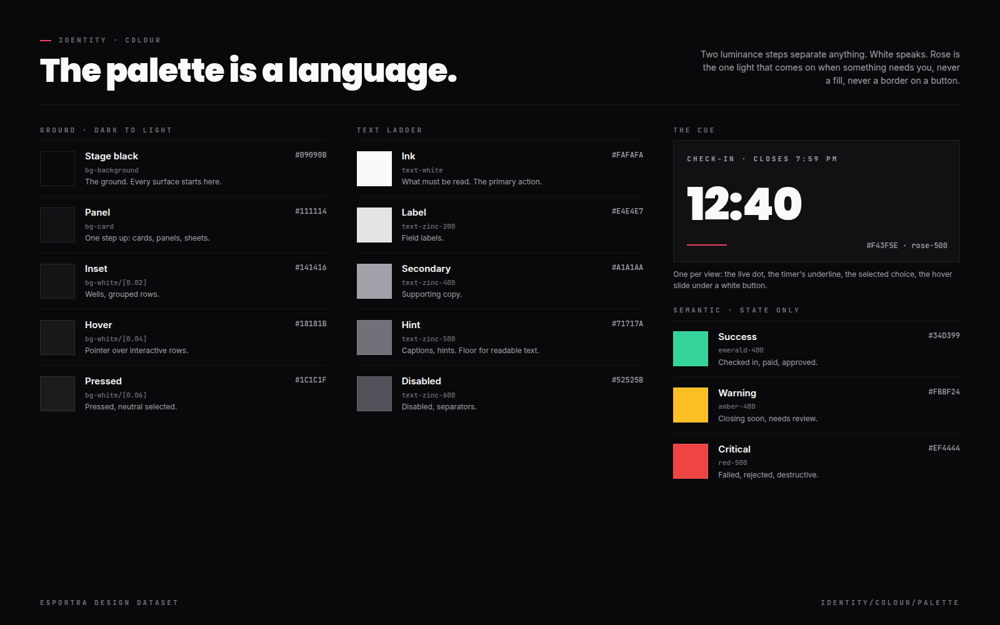 | [`identity/colour/palette.png`](identity/colour/palette.png) [html source](source/html/identity/colour/palette.html) | 1600×1000 | - | Ground ladder, text ladder, the rose cue and semantic tones with hex, Tailwind class and use. | - |
| 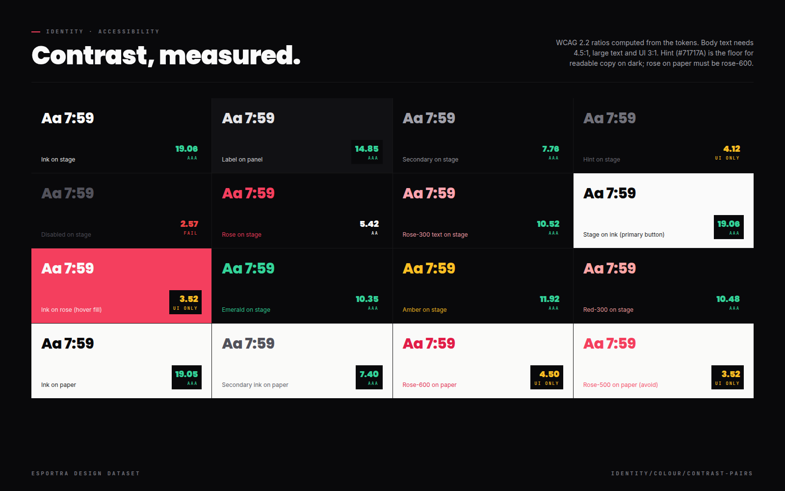 | [`identity/colour/contrast-pairs.png`](identity/colour/contrast-pairs.png) [html source](source/html/identity/colour/contrast-pairs.html) | 1600×1000 | - | WCAG contrast ratios computed from the tokens, dark and paper grounds. | - |
| 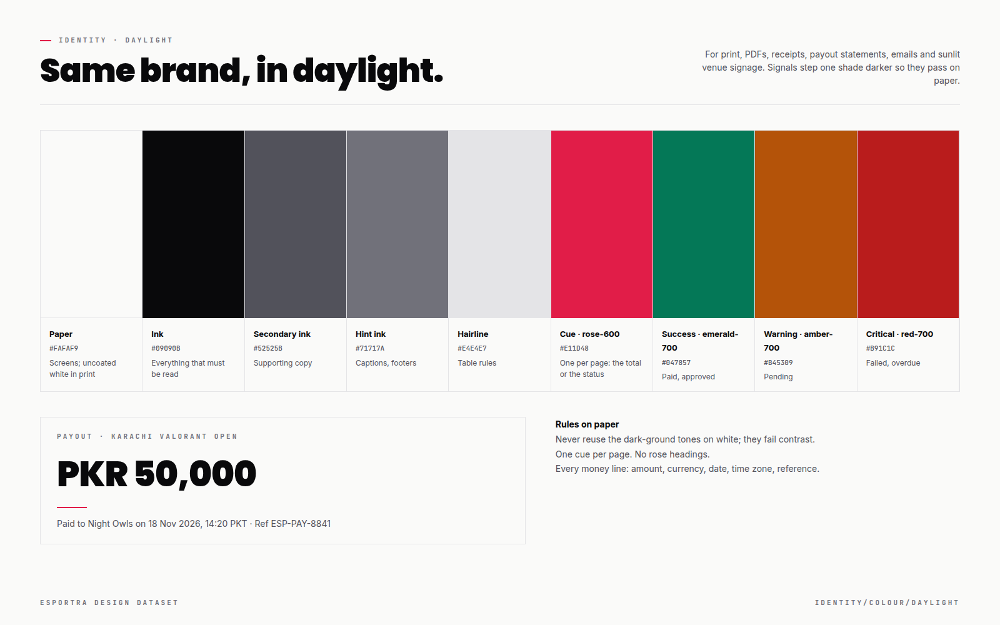 | [`identity/colour/daylight.png`](identity/colour/daylight.png) [html source](source/html/identity/colour/daylight.html) | 1600×1000 | - | Daylight (paper) palette with darker signal variants and a payout example. | - |
| 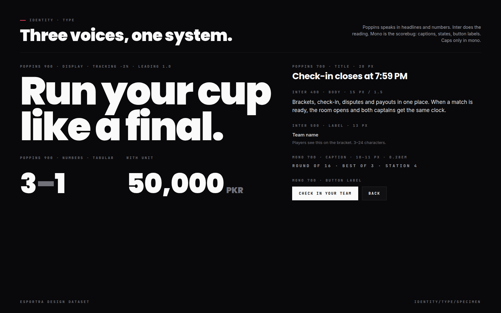 | [`identity/type/specimen.png`](identity/type/specimen.png) [html source](source/html/identity/type/specimen.html) | 1600×1000 | - | Poppins display and numbers, Inter body and labels, mono captions and button labels. | - |
| 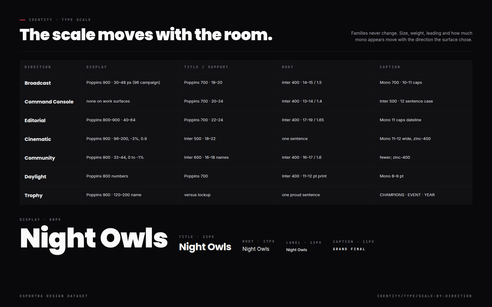 | [`identity/type/scale-by-direction.png`](identity/type/scale-by-direction.png) [html source](source/html/identity/type/scale-by-direction.html) | 1600×1000 | - | How the type scale changes per design direction. | - |
| 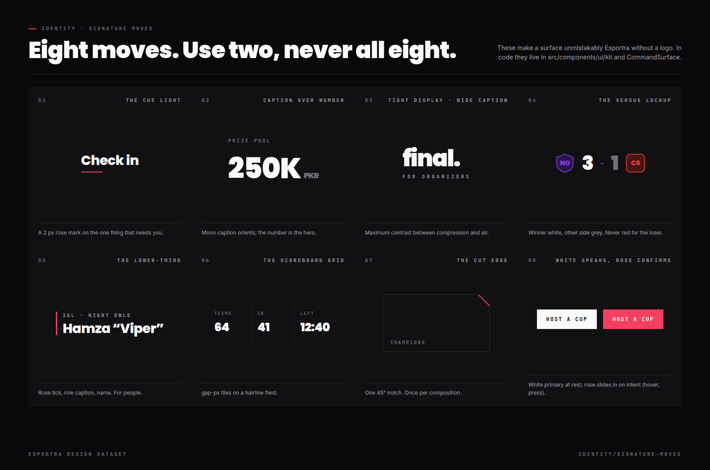 | [`identity/signature-moves.png`](identity/signature-moves.png) [html source](source/html/identity/signature-moves.html) | 1600×1060 | - | The eight signature moves, each drawn with its rule. | - |
| 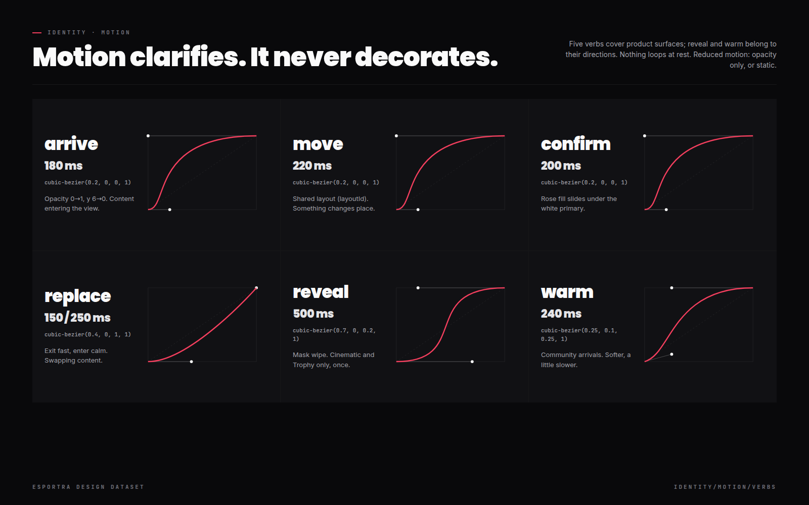 | [`identity/motion/verbs.png`](identity/motion/verbs.png) [html source](source/html/identity/motion/verbs.html) | 1600×1000 | - | Motion verbs with durations and plotted easing curves. | - |
| 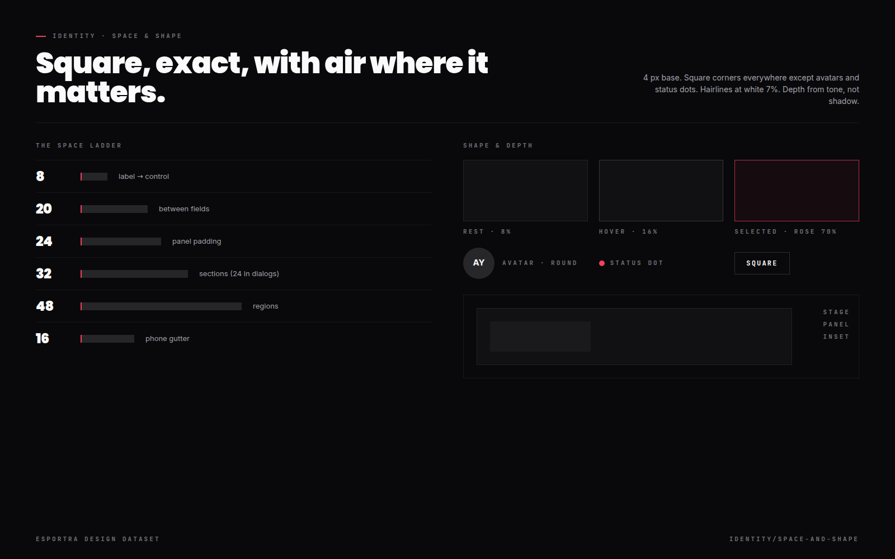 | [`identity/space-and-shape.png`](identity/space-and-shape.png) [html source](source/html/identity/space-and-shape.html) | 1600×1000 | - | Space ladder, card outline states, shape rules and tonal depth. | - |
| 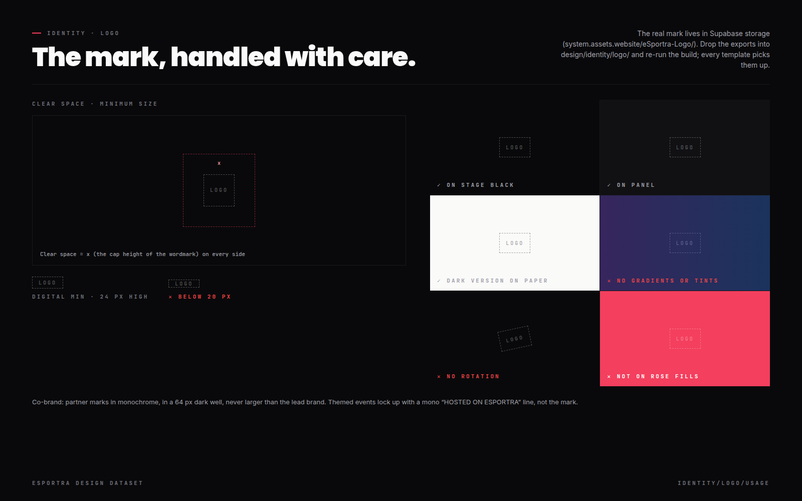 | [`identity/logo/usage.png`](identity/logo/usage.png) [html source](source/html/identity/logo/usage.html) | 1600×1000 | - | Logo clear space, minimum size, allowed grounds and misuse. Uses the real mark once exported into design/identity/logo/. | - |

## Textures and backgrounds

Regenerable backgrounds and overlays. Each has an SVG next to the PNG, so it scales to any size.

| Preview | Asset | Size | Direction | What it shows | Use |
|---|---|---|---|---|---|
| 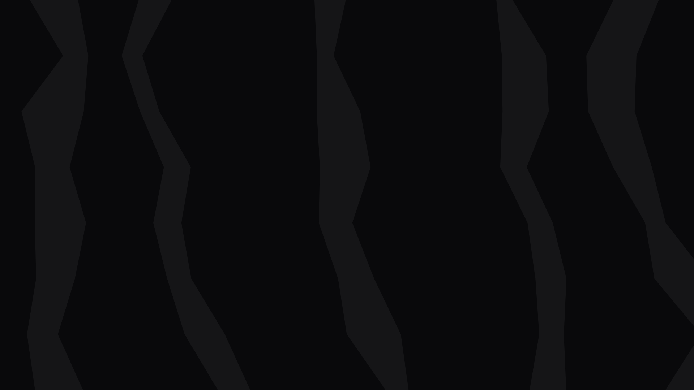 | [`textures/streak-shards.png`](textures/streak-shards.png) [svg](textures/streak-shards.svg) [html source](source/html/textures/streak-shards.html) | 1920×1080 | broadcast | Vector streak shards on stage black - the brand background, regenerable at any size. | Landing and event backgrounds behind a hero. Keep text on the dark gaps. |
| 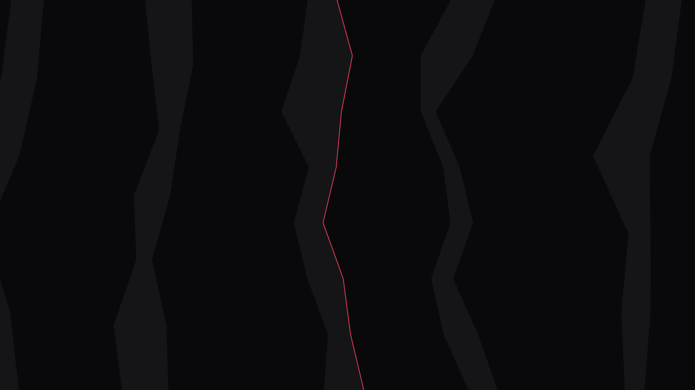 | [`textures/streak-shards-cue.png`](textures/streak-shards-cue.png) [svg](textures/streak-shards-cue.svg) [html source](source/html/textures/streak-shards-cue.html) | 1920×1080 | broadcast | Streak shards with one rose-edged shard - the cue light as texture. | Announcement key art where nothing else on the frame uses rose. |
| 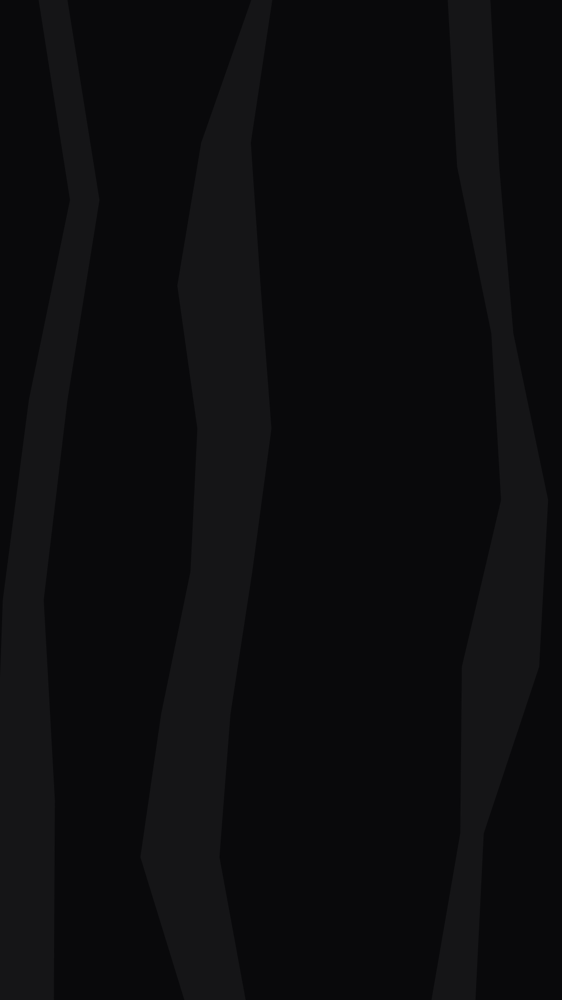 | [`textures/streak-shards-portrait.png`](textures/streak-shards-portrait.png) [svg](textures/streak-shards-portrait.svg) [html source](source/html/textures/streak-shards-portrait.html) | 1080×1920 | broadcast | Portrait streak shards for stories and phone wallpapers. | - |
|  | [`textures/spotlight.png`](textures/spotlight.png) [svg](textures/spotlight.svg) [html source](source/html/textures/spotlight.html) | 1920×1080 | cinematic | One cool stage light with a soft falloff and a darkened floor. | Cinematic heroes: one light source, never multicolour gradients. |
|  | [`textures/trophy-light.png`](textures/trophy-light.png) [svg](textures/trophy-light.svg) [html source](source/html/textures/trophy-light.html) | 1920×1080 | trophy | Warm key light for champion moments. | Behind a champion crest or name. Pair with the team colour glow only on the champion card. |
| 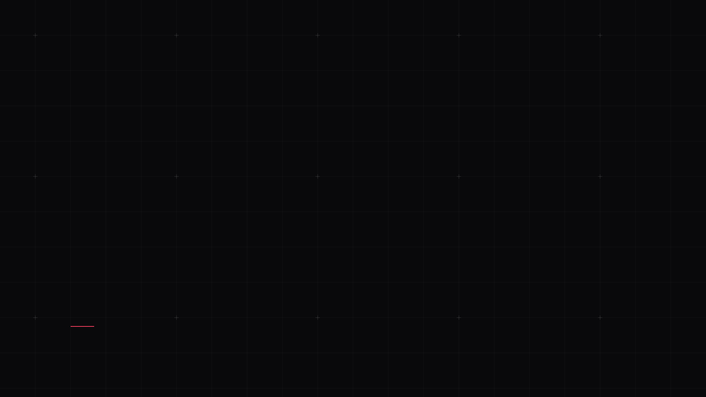 | [`textures/hairline-grid.png`](textures/hairline-grid.png) [svg](textures/hairline-grid.svg) [html source](source/html/textures/hairline-grid.html) | 1920×1080 | command-console | 96 px hairline field with crosshair registration marks and a rose tick. | Technical and product-launch backdrops; UI screenshots float on it. |
| 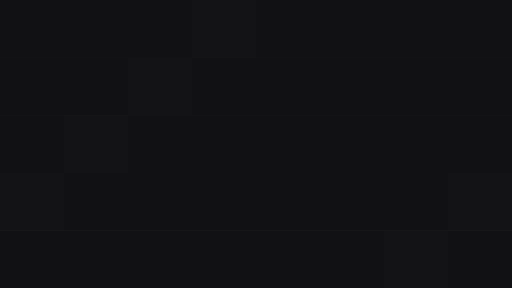 | [`textures/scoreboard-field.png`](textures/scoreboard-field.png) [svg](textures/scoreboard-field.svg) [html source](source/html/textures/scoreboard-field.html) | 1920×1080 | broadcast | The gap-px scoreboard grid as a full-bleed field. | Stats and schedule graphics; fill tiles with numbers. |
| 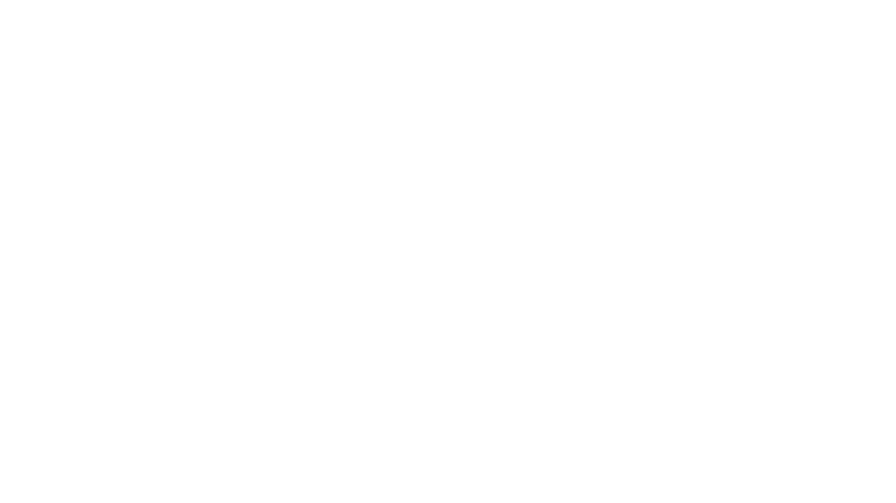 | [`textures/grain.png`](textures/grain.png) [svg](textures/grain.svg) [html source](source/html/textures/grain.html) | 1920×1080 transparent | - | Transparent film grain (noise-driven white, up to ~18% alpha) to lay over flat grounds. | Overlay at 50-100% on key art only, never on product UI. |
| 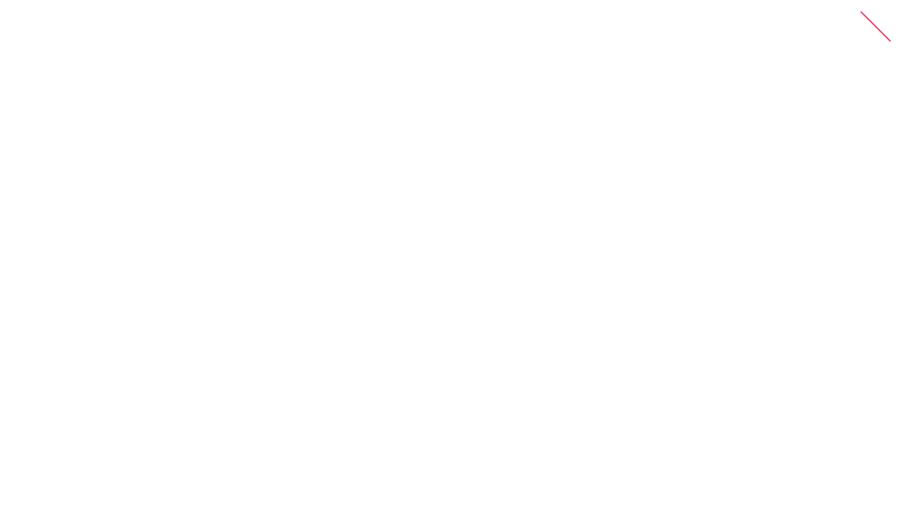 | [`textures/cut-edge-frame.png`](textures/cut-edge-frame.png) [svg](textures/cut-edge-frame.svg) [html source](source/html/textures/cut-edge-frame.html) | 1920×1080 transparent | trophy | Transparent 16:9 frame with the 45° notch and rose cut line. | Frame a champion photo or stream scene. Once per composition. |
| 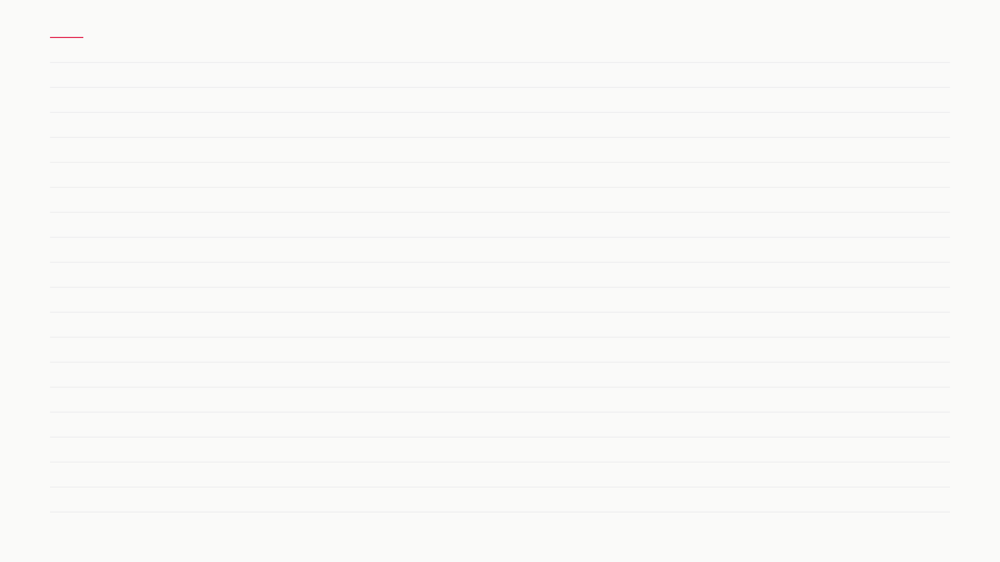 | [`textures/daylight-paper.png`](textures/daylight-paper.png) [svg](textures/daylight-paper.svg) [html source](source/html/textures/daylight-paper.html) | 1920×1080 | daylight | Paper ground with hairline rules and a rose-600 cue tick. | Printed schedules, rulebooks, statements. |

## Design directions

One board per direction from `design-recipe`: a composed example plus when to use it, ingredients and do/don't. Choose the direction from the context signals first, then look here.

| Preview | Asset | Size | Direction | What it shows | Use |
|---|---|---|---|---|---|
| 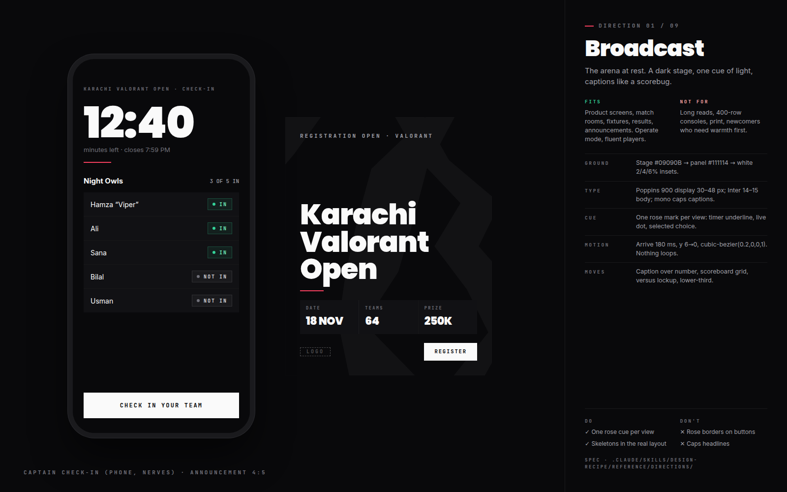 | [`directions/broadcast.png`](directions/broadcast.png) [html source](source/html/directions/broadcast.html) | 1600×1000 | broadcast | Broadcast: captain check-in on a phone and a 4:5 announcement, with the direction spec. | - |
| 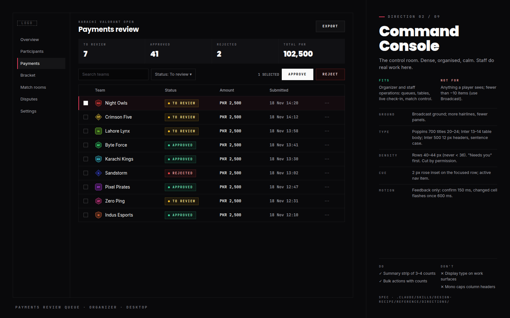 | [`directions/command-console.png`](directions/command-console.png) [html source](source/html/directions/command-console.html) | 1600×1000 | command-console | Command Console: organizer payments review queue with summary strip, filters, bulk actions and a focused row. | - |
| 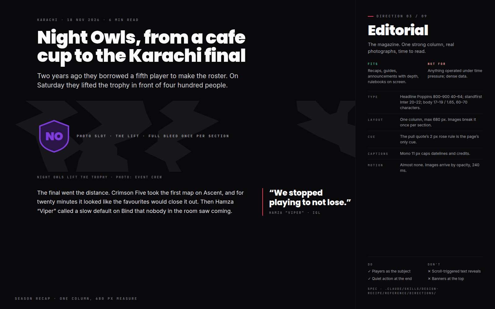 | [`directions/editorial.png`](directions/editorial.png) [html source](source/html/directions/editorial.html) | 1600×1000 | editorial | Editorial: season recap with dateline, standfirst, full-bleed image slot and pull quote. | - |
| 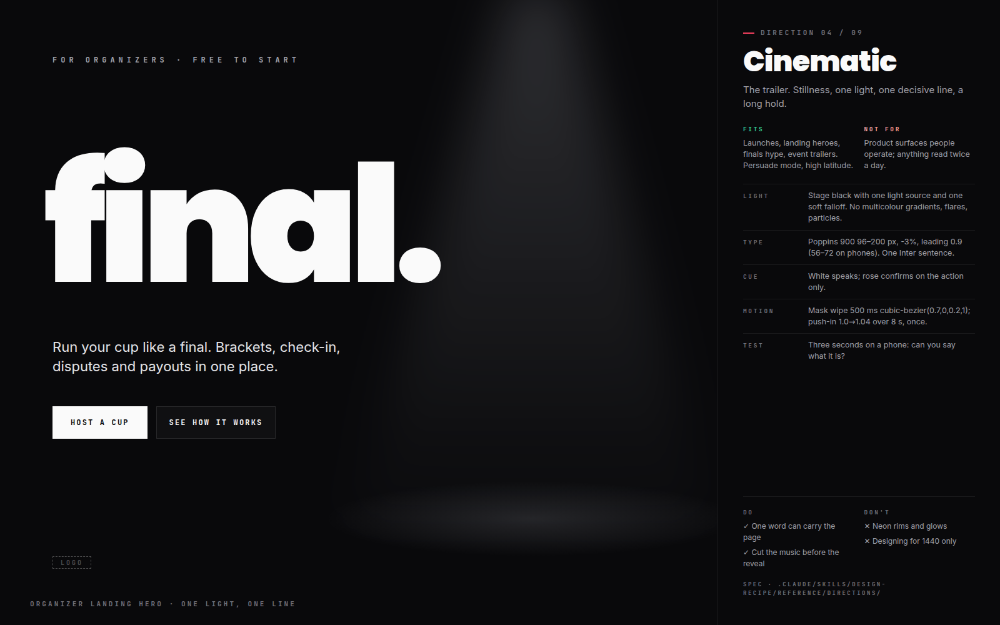 | [`directions/cinematic.png`](directions/cinematic.png) [html source](source/html/directions/cinematic.html) | 1600×1000 | cinematic | Cinematic: organizer landing hero, one light, one word. | - |
| 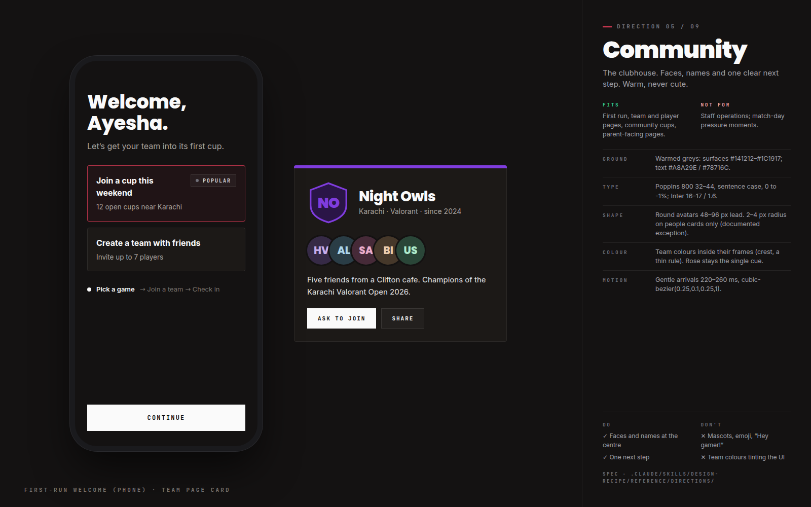 | [`directions/community.png`](directions/community.png) [html source](source/html/directions/community.html) | 1600×1000 | community | Community: first-run welcome on a phone and a team page card with avatars, warm greys. | - |
| 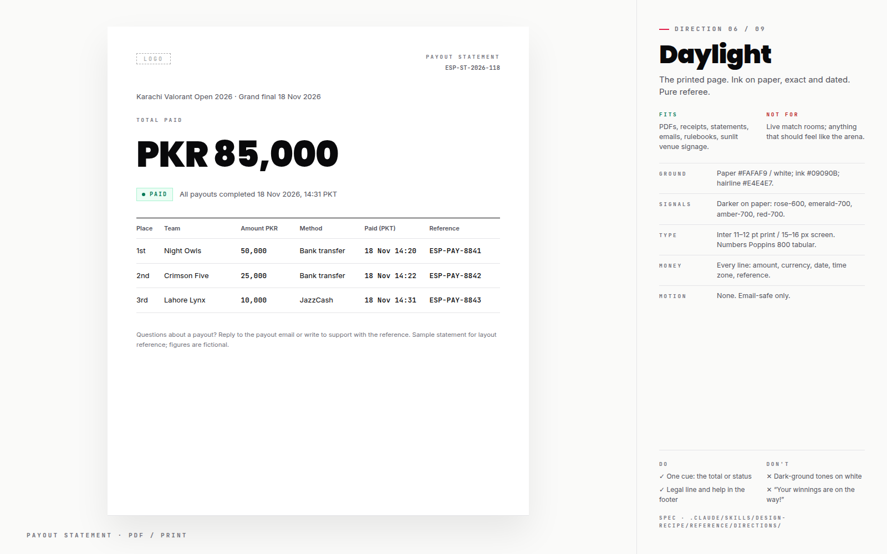 | [`directions/daylight.png`](directions/daylight.png) [html source](source/html/directions/daylight.html) | 1600×1000 | daylight | Daylight: payout statement on paper with darker signals and complete money lines. | - |
| 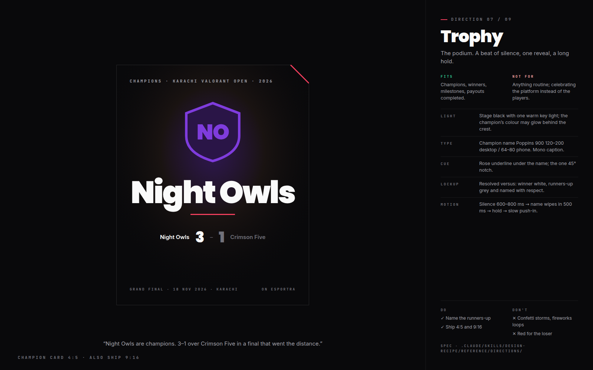 | [`directions/trophy.png`](directions/trophy.png) [html source](source/html/directions/trophy.html) | 1600×1000 | trophy | Trophy: 4:5 champion card with warm light, team glow, notch and resolved versus lockup. | - |
| 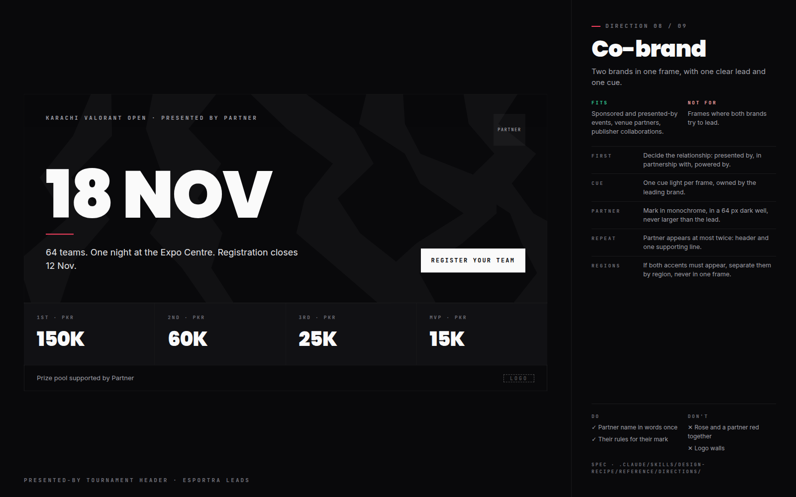 | [`directions/co-brand.png`](directions/co-brand.png) [html source](source/html/directions/co-brand.html) | 1600×1000 | co-brand | Co-brand: presented-by tournament header with a monochrome partner well and prize scoreboard. | - |
| 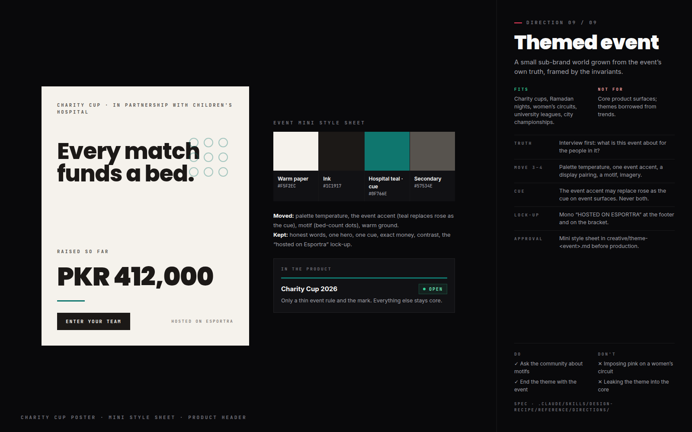 | [`directions/themed-event.png`](directions/themed-event.png) [html source](source/html/directions/themed-event.html) | 1600×1000 | themed-event | Themed event: charity cup poster, mini style sheet and how the theme appears in the product. | - |

## Templates

Production-shaped layouts for social, web, email, stream and venue screens, filled with fictional sample data.

| Preview | Asset | Size | Direction | What it shows | Use |
|---|---|---|---|---|---|
| 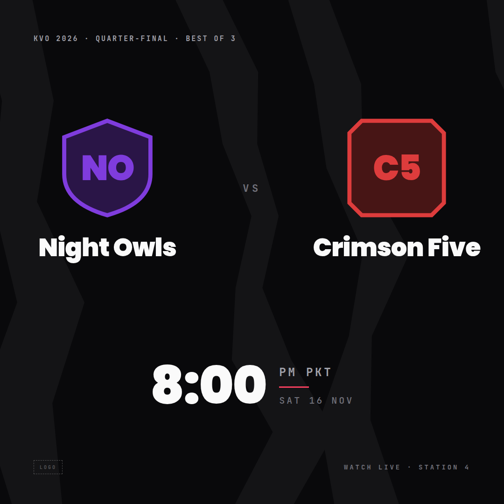 | [`templates/social/fixture-1x1.png`](templates/social/fixture-1x1.png) [html source](source/html/templates/social/fixture-1x1.html) | 1080×1080 | broadcast | Match-day fixture post: versus lockup, time in PKT, station. | Instagram/X feed, WhatsApp communities. |
| 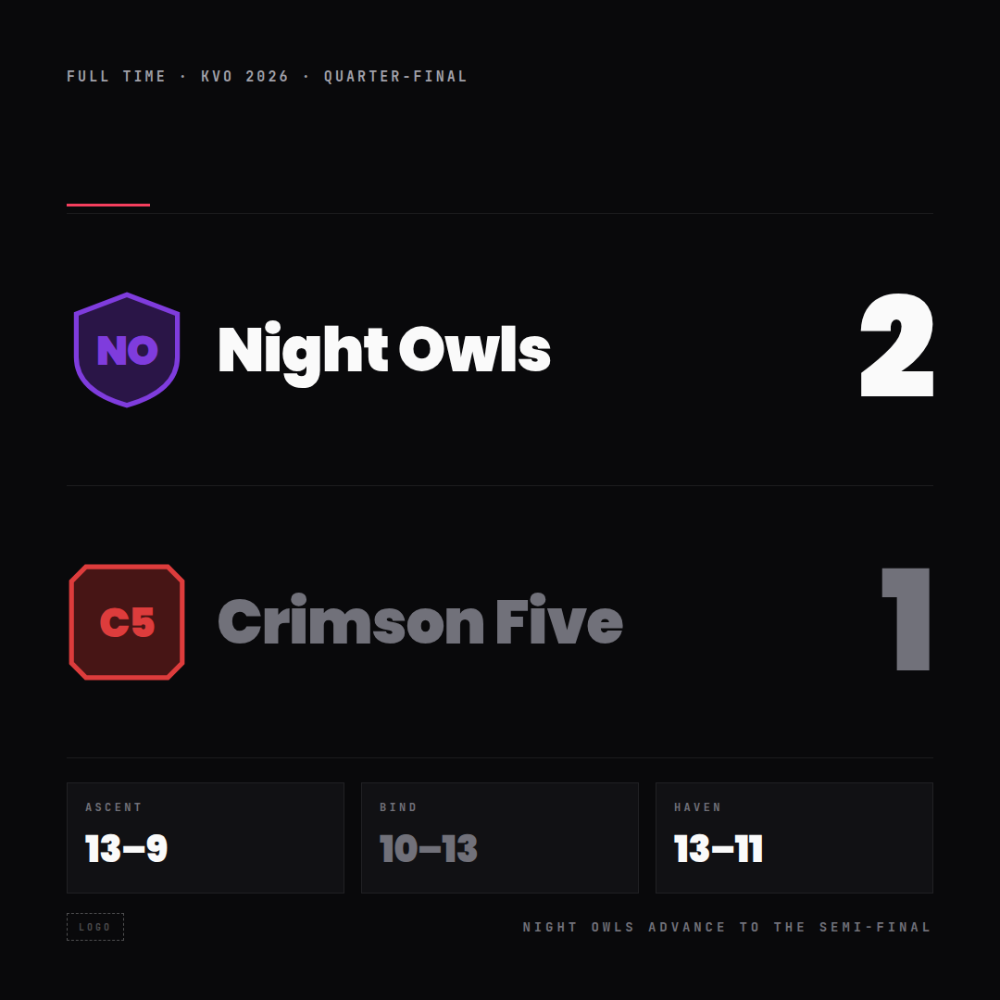 | [`templates/social/result-1x1.png`](templates/social/result-1x1.png) [html source](source/html/templates/social/result-1x1.html) | 1080×1080 | broadcast | Result post: winner white, loser grey, map-by-map scoreboard. | Feed post right after full time. |
| 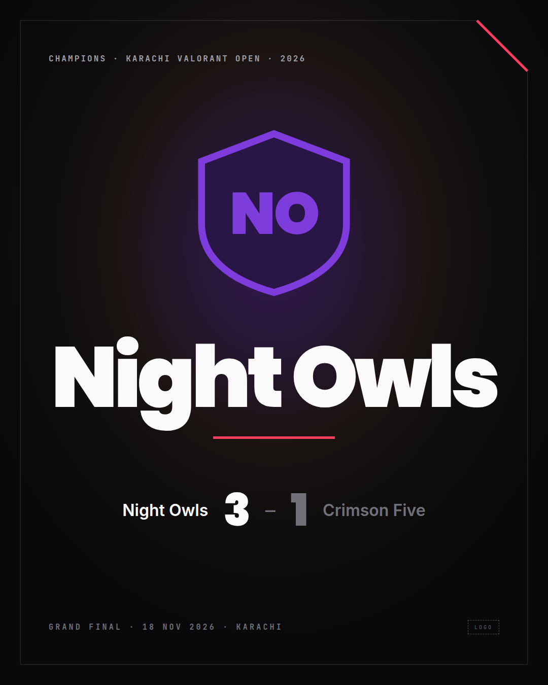 | [`templates/social/champion-4x5.png`](templates/social/champion-4x5.png) [html source](source/html/templates/social/champion-4x5.html) | 1080×1350 | trophy | Champion card 4:5 with warm light, team glow, notch and resolved lockup. | The one celebratory post per event. |
| 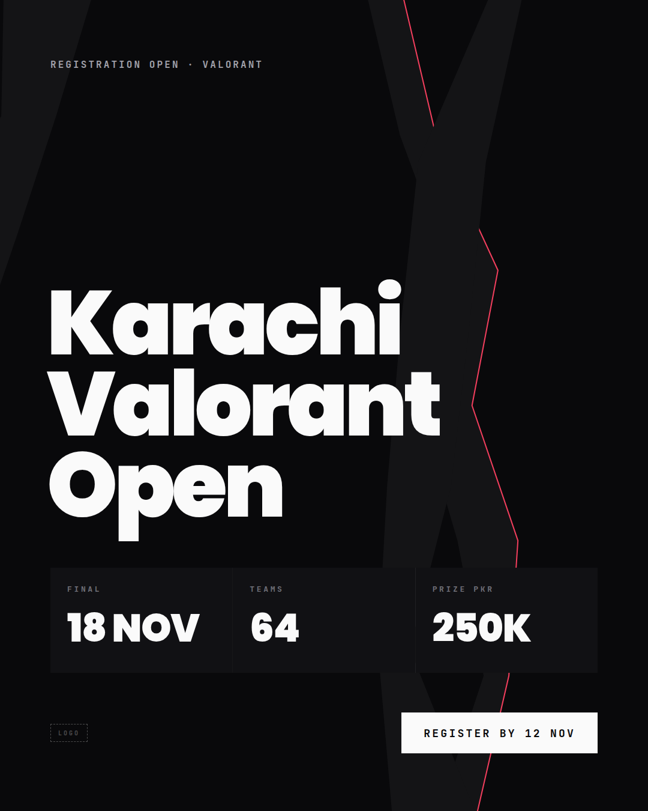 | [`templates/social/registration-open-4x5.png`](templates/social/registration-open-4x5.png) [html source](source/html/templates/social/registration-open-4x5.html) | 1080×1350 | broadcast | Registration announcement 4:5 with scoreboard facts and a dated action. | Launch post for an event. |
| 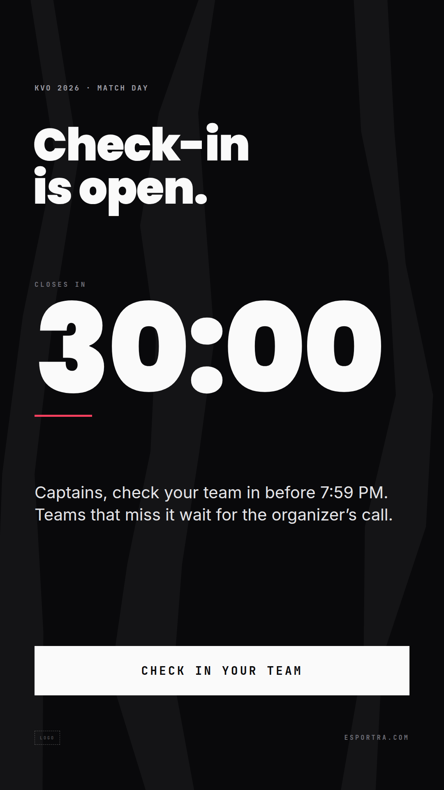 | [`templates/social/check-in-story-9x16.png`](templates/social/check-in-story-9x16.png) [html source](source/html/templates/social/check-in-story-9x16.html) | 1080×1920 | broadcast | Check-in story with countdown hero and one action. | Instagram/WhatsApp story 30 minutes before a window. |
| 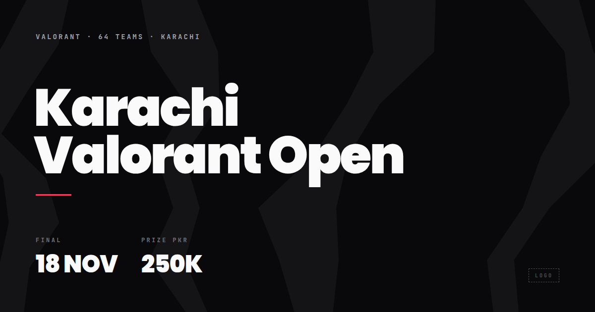 | [`templates/web/og-image.png`](templates/web/og-image.png) [html source](source/html/templates/web/og-image.html) | 1200×630 | broadcast | Open Graph share image for a tournament page. | og:image / twitter:image. |
| 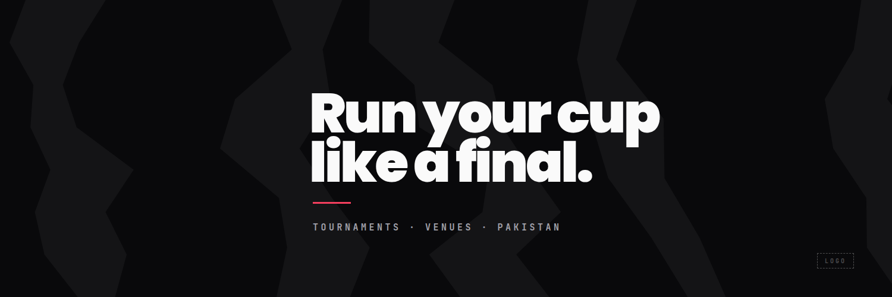 | [`templates/web/channel-banner.png`](templates/web/channel-banner.png) [html source](source/html/templates/web/channel-banner.html) | 1500×500 | cinematic | Channel header with the organizer promise; safe area on the right two-thirds. | X header, YouTube/Twitch banner (crop-safe centre). |
| 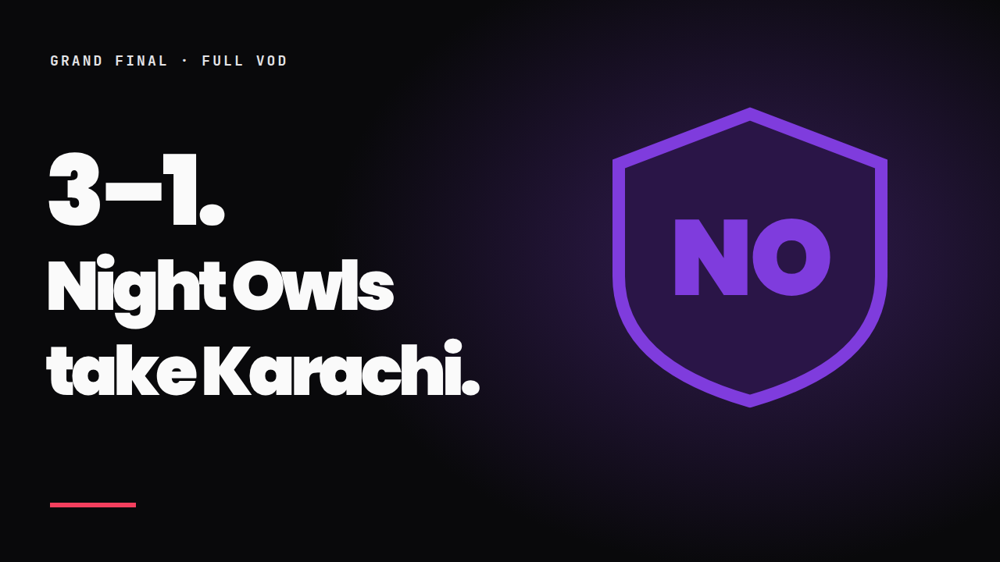 | [`templates/web/video-thumbnail.png`](templates/web/video-thumbnail.png) [html source](source/html/templates/web/video-thumbnail.html) | 1280×720 | trophy | VOD thumbnail: result as the hero, champion crest at scale. | YouTube thumbnails. |
| 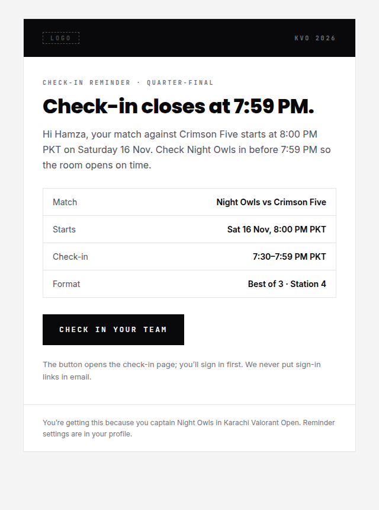 | [`templates/email/check-in-reminder.png`](templates/email/check-in-reminder.png) [html source](source/html/templates/email/check-in-reminder.html) | 640×860 | daylight | Transactional reminder email in Daylight: facts table, one action, no sign-in links. | T-30 and T-10 captain reminders. |
| 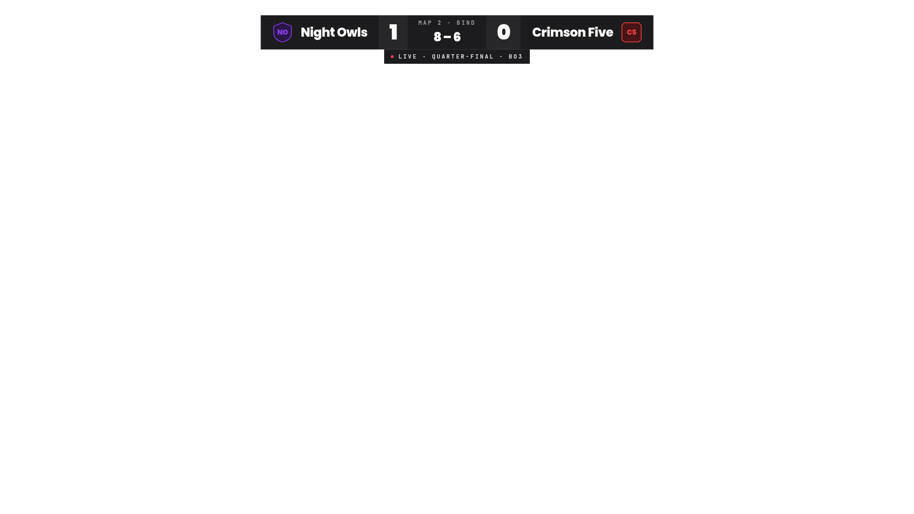 | [`templates/stream/scorebug.png`](templates/stream/scorebug.png) [html source](source/html/templates/stream/scorebug.html) | 1920×1080 transparent | broadcast | Transparent broadcast scorebug with series score, map and live tag. | OBS overlay above gameplay. |
| 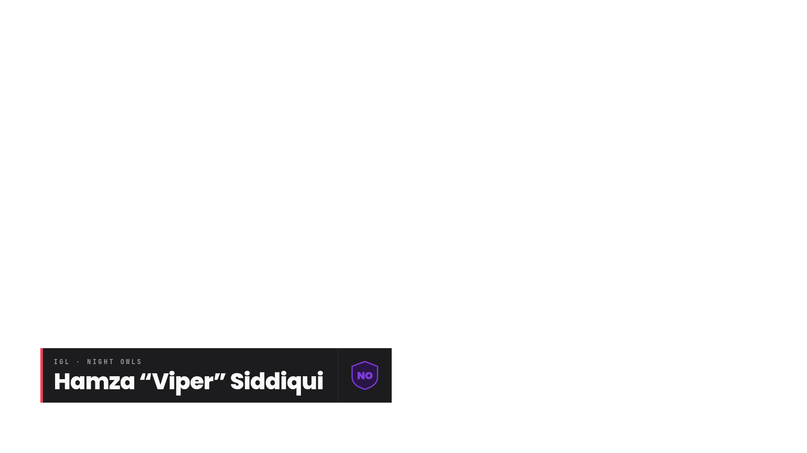 | [`templates/stream/lower-third.png`](templates/stream/lower-third.png) [html source](source/html/templates/stream/lower-third.html) | 1920×1080 transparent | broadcast | Transparent lower-third: rose tick, role caption, name, crest. | Caster desk and player interviews. |
| 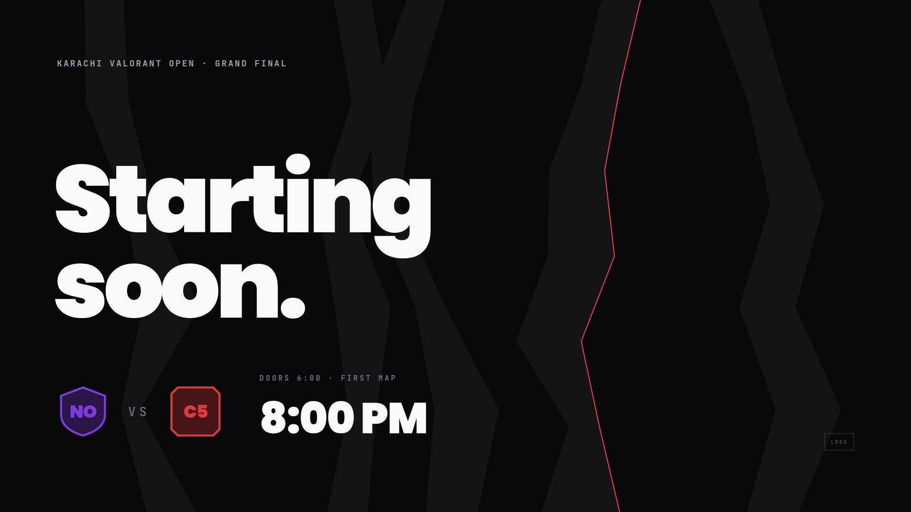 | [`templates/stream/starting-soon.png`](templates/stream/starting-soon.png) [html source](source/html/templates/stream/starting-soon.html) | 1920×1080 | cinematic | Starting-soon screen with the final’s matchup and time. | Stream holding screen. |
| 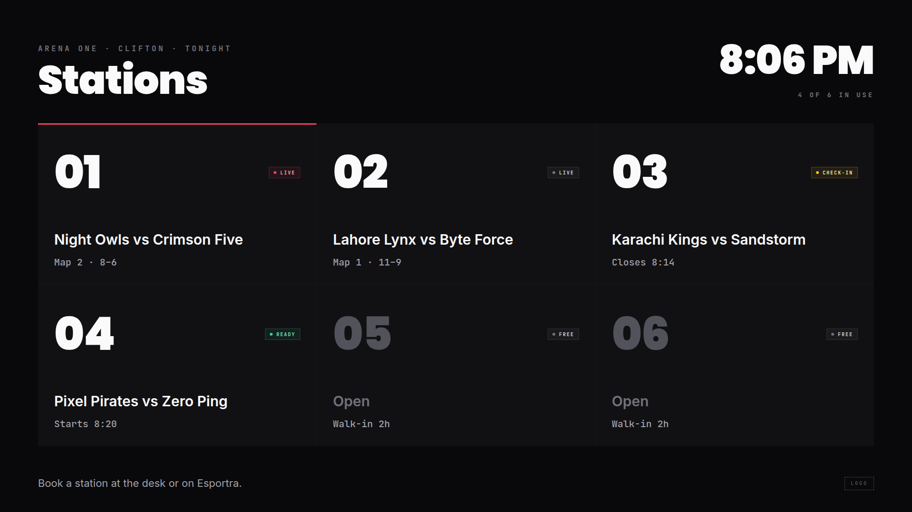 | [`templates/venue/station-board.png`](templates/venue/station-board.png) [html source](source/html/templates/venue/station-board.html) | 1920×1080 | command-console | Venue TV board: six stations with live state, readable across a room. | Venue screens driven by the station agent. |

## UI reference

States every product flow must design, drawn with the real kit tokens.

| Preview | Asset | Size | Direction | What it shows | Use |
|---|---|---|---|---|---|
| 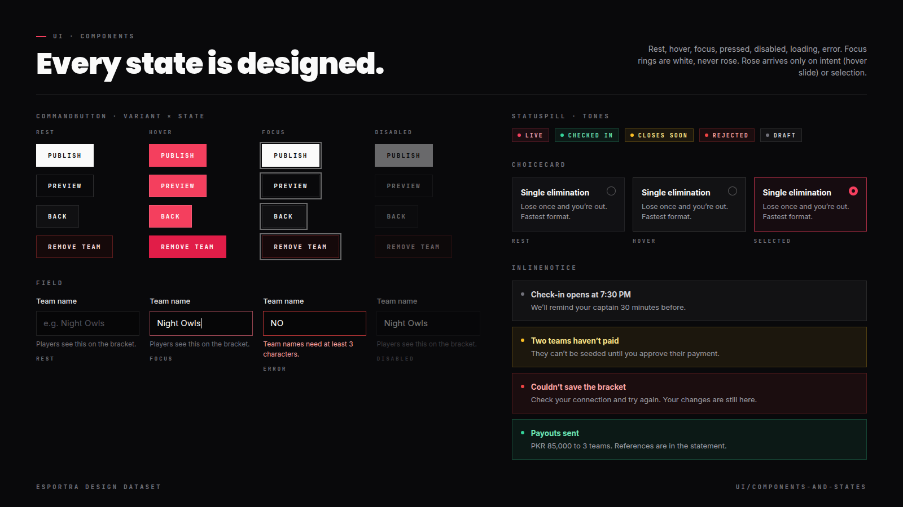 | [`ui/components-and-states.png`](ui/components-and-states.png) [html source](source/html/ui/components-and-states.html) | 1600×900 | broadcast | CommandButton variants × states, field states, status pill tones, choice card states and inline notices. | - |
| 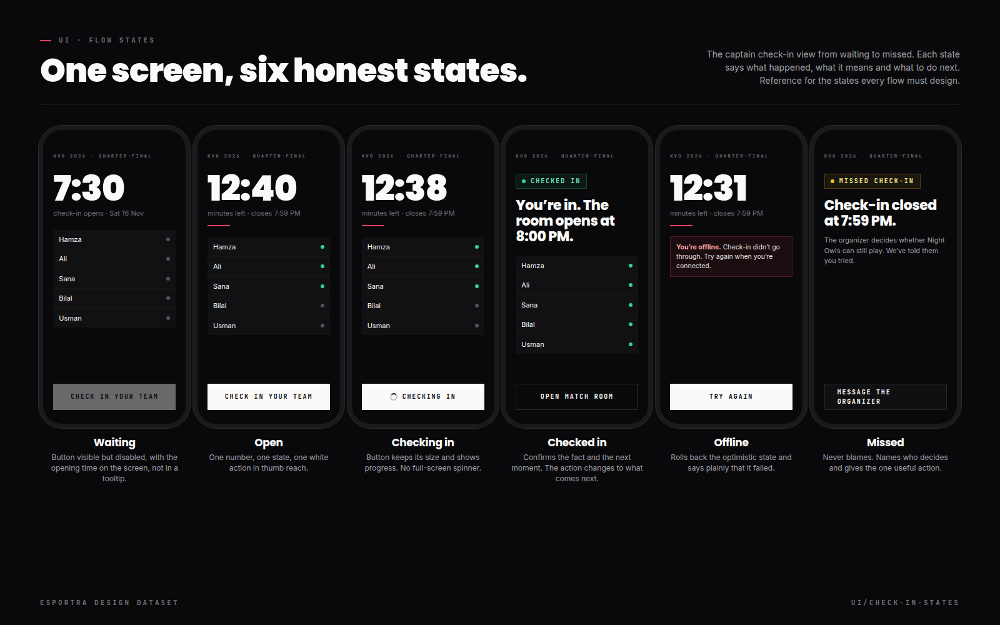 | [`ui/check-in-states.png`](ui/check-in-states.png) [html source](source/html/ui/check-in-states.html) | 1600×1000 | broadcast | Captain check-in screen across six states: waiting, open, checking in, checked in, offline, missed. | - |
| 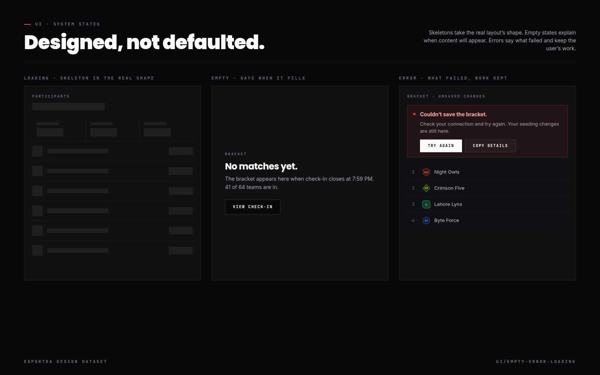 | [`ui/empty-error-loading.png`](ui/empty-error-loading.png) [html source](source/html/ui/empty-error-loading.html) | 1600×1000 | broadcast | Skeleton in the real layout, an empty state that says when it fills, an error that keeps work. | - |

## Esportra Broadcast (HUD tool) UI/UX

Screens for the Esportra Broadcast tool: web ops (Esportra → Broadcast) and the desktop production node. Behaviour, motion and data contracts are in hud-studio/README.md.

| Preview | Asset | Size | Direction | What it shows | Use |
|---|---|---|---|---|---|
| 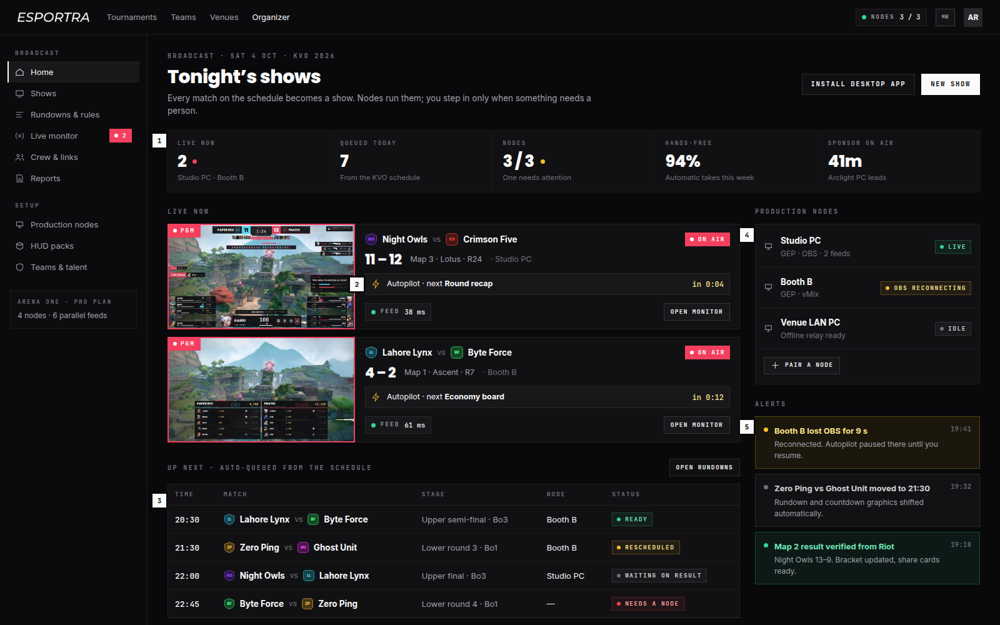 | [`hud-studio/web-01-home.png`](hud-studio/web-01-home.png) [html source](source/html/hud/web-01-home.html) | 1600×1000 | command console | Web · Broadcast home: live shows with autopilot state, the queue built from the schedule, production nodes, alerts. | - |
| 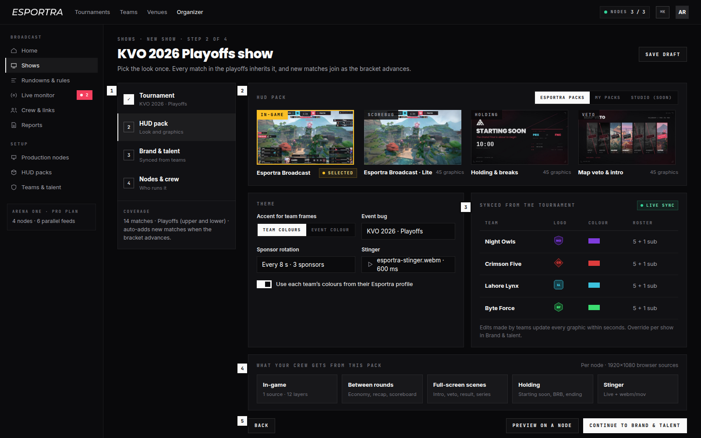 | [`hud-studio/web-02-show-setup.png`](hud-studio/web-02-show-setup.png) [html source](source/html/hud/web-02-show-setup.html) | 1600×1000 | command console | Web · Show setup step 2: HUD pack, theme, and teams synced from the tournament. | - |
| 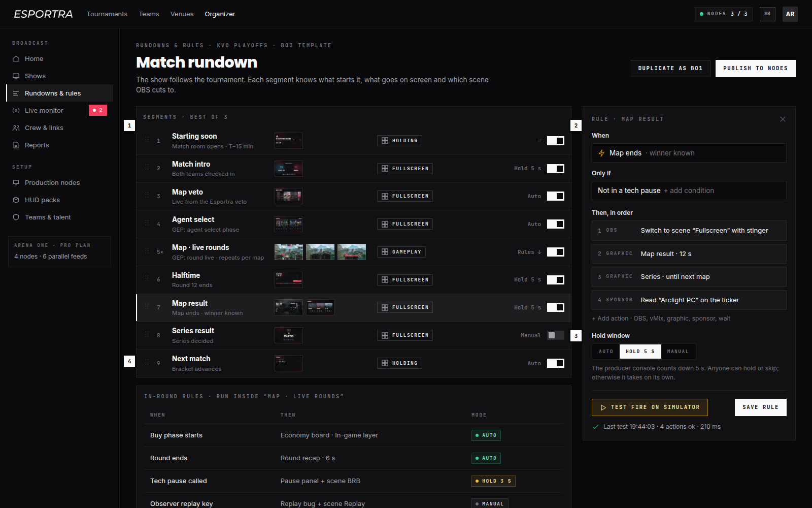 | [`hud-studio/web-03-rundown.png`](hud-studio/web-03-rundown.png) [html source](source/html/hud/web-03-rundown.html) | 1600×1000 | command console | Web · Rundown and rules: segments driven by tournament state, each with graphics, OBS scene and hold window; rule editor with test fire. | - |
| 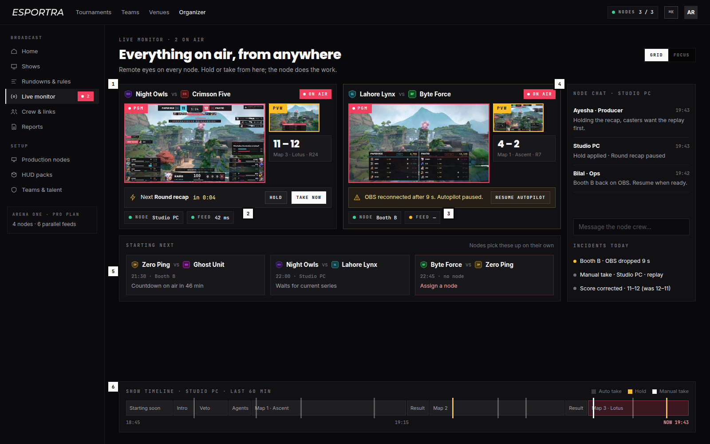 | [`hud-studio/web-04-live-monitor.png`](hud-studio/web-04-live-monitor.png) [html source](source/html/hud/web-04-live-monitor.html) | 1600×1000 | command console | Web · Live monitor: every node on air with PGM/PVW, autopilot countdown, remote hold/take, node chat and incidents. | - |
