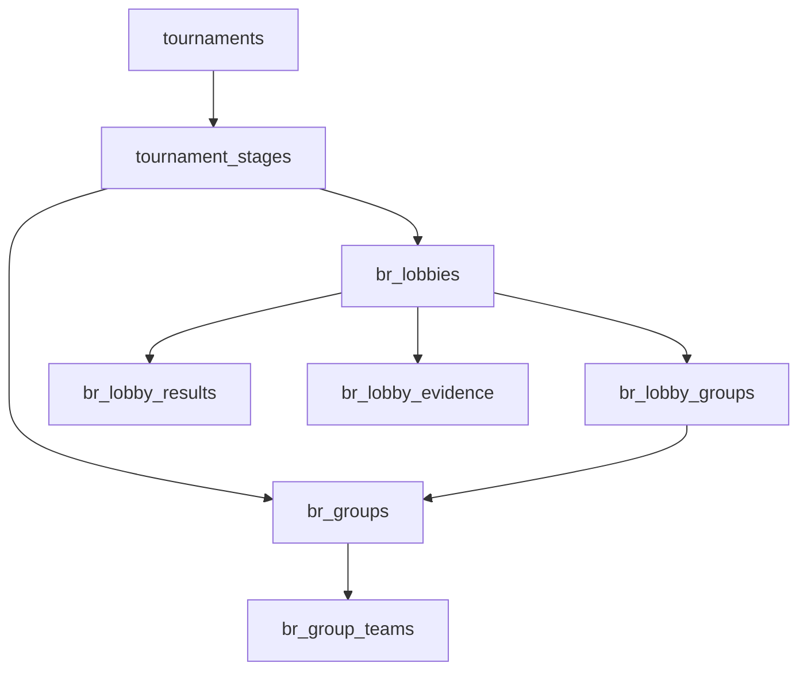

# Battle Royale Pro Structure — Gold-Standard Implementation Spec

**Version:** 1.0 (pro structure)  
**Platform:** Esportra (Frag & Book)  
**Status:** Authoritative — supersedes `docs/battle-royale-structure-spec.md`  
**Goal:** A professional, game-agnostic Battle Royale tournament engine that supports **Group Rotation** (integrity standard), **Multi-Lobby Cut / Gauntlet** (operational filter), and their **hybrid** macro-structure — with per-game behavior derived entirely from the game catalog, not hardcoded title logic.

---

## 1. Goals and principles

### 1.1 What this spec solves

The shipped lean-v1 BR engine treats **groups and lobbies as the same entity**: each `br_group` runs its own isolated rounds, per-group leaderboards, and per-group advancement. That model cannot express:

- **Group Rotation** — seed groups A/B/C/D mixed into shared lobbies per wave so every unit plays every opponent equally (e.g. Round 1: A+B vs C+D).
- **Multi-Lobby Cut / Gauntlet** — hundreds of units funnelled through parallel lobbies with threshold cuts into fewer lobbies in the next stage.
- **Stage-global leaderboards** — one master ranking across all lobbies in a stage (required for rotation and overall cuts).
- **Multi-lobby next stages** — advance survivors into M lobbies, not always a single "Finals" group.

This spec defines the **pro structure engine** that replaces the current stage-config UX and extends the data model accordingly.

### 1.2 Guiding principles

1. **Game-agnostic core** — no `if (game === 'apex')` branches. All per-game values come from `BRConfig` in the game catalog (`playersPerLobby`, `scoringPresets`, `maps`, `defaultMapMode`) plus tournament `teamSize`.
2. **Tournament wizard owns scoring** — placement/kill points, kill cap, and tiebreaker are set once at tournament creation and apply to every stage. Stages never override scoring.
3. **Stages own structure** — each stage declares its **format** (how lobbies are formed) and **advancement** (how survivors progress). Scoring is inherited.
4. **Seed groups ≠ physical lobbies** — abstract pools (A, B, C, D) are separate from the playable lobby instances that compose them each wave.
5. **Deterministic schedules** — matchup generation is pure math (circle method / 1-factorization). Organizers preview before commit; broadcast crews get a static match count.
6. **Relational model only** — extend `br_groups` / `br_rounds` / `br_round_results`; do not extend the legacy JSON path (`useBRGameResults.ts`, `br_game_data`).
7. **Backward compatibility** — existing `static_groups` and `single_lobby` tournaments map 1:1 onto the new model without data loss.
8. **UI clarity** — stage configuration is a flat, step-by-step wizard with plain-language explanations. No nested accordions, no SVG/lucide icons on setup surfaces.

### 1.3 Terminology (locked)

| Term | Meaning |
|------|---------|
| **Competing unit** | Team or solo player — one row in standings |
| **Stage** | Ordered tournament phase (Qualifiers, League, Grand Finals) |
| **Seed group** | Abstract roster pool within a stage (Group A, B, C, D) — fixed membership for the stage |
| **Wave** | One scheduling round within a stage — produces one or more physical lobbies |
| **Lobby** | One playable match instance in a wave — has lobby code, map, status, results |
| **Game / match** | Synonym for one completed lobby instance (best-of-1 always) |

---

## 2. Format taxonomy

Each stage declares `config.br.format`. Formats describe **how lobbies are formed and scored within the stage**, not how scoring points are calculated.

### 2.1 `single_lobby`

Everyone plays in one physical lobby. Equivalent to one seed group named "Main Lobby".

| Use case | Finals, small LANs, < lobby capacity |
| Leaderboard scope | `stage_global` (trivial — one lobby) |
| Typical advancement | `top_n_overall` or none (final stage) |

### 2.2 `static_groups`

N parallel lobbies with **fixed rosters**. Each seed group runs its own waves independently. No cross-group mixing.

| Use case | Open qualifiers with independent heats, regional splits |
| Leaderboard scope | `per_seed_group` |
| Typical advancement | `top_n_per_group` |

**This is the current shipped v1 behavior**, expressed explicitly as a format.

### 2.3 `group_rotation` — Integrity Standard

Seed groups (typically 4: A, B, C, D) are **mixed into shared lobbies each wave** according to a balanced matchup schedule. Every seed group plays every other seed group the same number of times across the stage.

**Example (40 teams, 4 groups of 10, 2 lobbies per wave):**

| Wave | Lobby 1 | Lobby 2 |
|------|---------|---------|
| 1 | A + B | C + D |
| 2 | A + C | B + D |
| 3 | A + D | B + C |

| Property | Value |
|----------|-------|
| Leaderboard scope | `stage_global` — one master ranking across all waves and lobbies |
| Typical game count | 12–18 matches (3+ waves × multiple lobbies × matches per matchup) |
| Advancement | `top_n_overall` from stage-global standings |
| Why pros use it | Eliminates "lucky lobby" syndrome; large sample size; predictable broadcast schedule |

### 2.4 `multi_lobby_cut` — Operational Filter

N parallel lobbies each run a short blitz (3–6 games). Bottom performers are eliminated via threshold cut. Survivors funnel to the next stage (which may have fewer lobbies).

**Example (100 teams → 5 lobbies of 20, top 4 per lobby):**

```
Phase 1: 100 teams → 5 lobbies × 20 → top 4 each → 20 survivors
Phase 2: 20 teams → 1 lobby → top 10 → Grand Finals
```

| Property | Value |
|----------|-------|
| Leaderboard scope | `per_lobby` during the stage; cut uses lobby-local rank |
| Typical advancement | `top_n_per_lobby` or `threshold` (rank ≤ N) |
| Why pros use it | Weekend-scale funnel; simple admin rule (`IF rank <= 4 THEN advance`); high bubble drama |

### 2.5 Hybrid macro-structure

**Hybrid is not a format** — it is a **multi-stage tournament blueprint** chaining formats:

```
Stage 1: multi_lobby_cut  (open funnel — thousands → 40)
Stage 2: group_rotation   (league tier — fairness + seeding)
Stage 3: single_lobby     (grand finals)
```

Major circuits (ALGS, PGC) use this pattern. The engine supports it by letting each stage declare its own `format` and `advancement`; no special hybrid type is needed.

### 2.6 Format selection matrix

| Registered units | Recommended format | Rationale |
|------------------|-------------------|-----------|
| ≤ maxLobbySize | `single_lobby` | Fits one game lobby |
| maxLobbySize < N ≤ 4 × maxLobbySize | `group_rotation` or `static_groups` | Rotation if integrity matters; static if speed matters |
| N > 4 × maxLobbySize | `multi_lobby_cut` (first stage) | Cannot run full rotation at scale |
| Curated pro pool (20–40) | `group_rotation` | Integrity standard for seeding |
| Finals (≤ maxLobbySize) | `single_lobby` | One winner-take-all lobby |

---

## 3. Data model and migration mapping

### 3.1 Current model (lean v1 — limitations)

```
tournament_stages
  └── br_groups          (seed group AND lobby — conflated)
        └── br_rounds    (FK group_id NOT NULL — 1:1 with group)
              └── br_round_results
```

**Limitations:**
- A round belongs to exactly one group; results must match that group's roster only.
- No cross-group lobby composition.
- Leaderboards are per-group only.
- Advance creates one "Finals" group on the next stage.

### 3.2 Target model (pro structure)

```
tournament_stages
  ├── br_groups              (SEED GROUPS — abstract roster pools)
  │     └── br_group_teams   (unit membership in seed group — unchanged)
  │
  └── br_lobbies             (NEW — physical lobby per wave)
        ├── br_lobby_groups  (NEW — junction: which seed groups compose this lobby)
        └── br_lobby_results (renamed/evolved from br_round_results)
```

**Compatibility alias:** For `static_groups` and `single_lobby`, each wave creates exactly one lobby per seed group with a 1:1 junction entry. Behavior is identical to today's `br_groups → br_rounds` flow.

### 3.3 New table: `br_lobbies`

```sql
CREATE TABLE br_lobbies (
    id                  UUID PRIMARY KEY DEFAULT gen_random_uuid(),
    stage_id            UUID NOT NULL REFERENCES tournament_stages(id) ON DELETE CASCADE,
    wave_number         INT  NOT NULL,          -- scheduling round within stage (1-based)
    lobby_index         INT  NOT NULL DEFAULT 0, -- 0-based index within wave
    lobby_code          TEXT,
    map                 TEXT,
    status              TEXT NOT NULL DEFAULT 'pending'
                            CHECK (status IN ('pending', 'active', 'completed')),
    scheduled_at        TIMESTAMPTZ,
    started_at          TIMESTAMPTZ,
    completed_at        TIMESTAMPTZ,
    queue_timer_minutes INT,
    queue_started_at    TIMESTAMPTZ,
    created_at          TIMESTAMPTZ NOT NULL DEFAULT now(),

    UNIQUE (stage_id, wave_number, lobby_index)
);

CREATE UNIQUE INDEX uq_br_lobbies_active_stage
    ON br_lobbies (stage_id)
    WHERE status = 'active';
-- At most one active lobby per stage (organizer workflow constraint; relaxable later)
```

### 3.4 New table: `br_lobby_groups`

```sql
CREATE TABLE br_lobby_groups (
    id          UUID PRIMARY KEY DEFAULT gen_random_uuid(),
    lobby_id    UUID NOT NULL REFERENCES br_lobbies(id) ON DELETE CASCADE,
    group_id    UUID NOT NULL REFERENCES br_groups(id) ON DELETE CASCADE,

    UNIQUE (lobby_id, group_id)
);
```

A lobby's **roster** is the union of all `br_group_teams` for linked seed groups. Result validation checks membership against this union.

### 3.5 Evolved table: `br_lobby_results` (from `br_round_results`)

Migration renames/repoints results from `round_id` → `lobby_id`:

```sql
-- Migration approach: add lobby_id, backfill, drop round_id
ALTER TABLE br_round_results RENAME TO br_lobby_results;
ALTER TABLE br_lobby_results RENAME COLUMN round_id TO lobby_id;
-- FK updated to br_lobbies(id)
-- All existing constraints preserved: placement uniqueness, entity uniqueness, solo/team XOR
```

### 3.6 Evolved table: `br_round_evidence` → `br_lobby_evidence`

Same repoint: `round_id` → `lobby_id`.

### 3.7 `br_groups` semantics change

`br_groups` becomes **seed groups only** — abstract roster pools. Columns retained:

| Column | Semantics |
|--------|-----------|
| `stage_id` | Parent stage |
| `name` | "Group A", "Group B", … |
| `group_order` | Sort order |
| `lobby_size` | **Deprecated for rotation formats** — kept for static_groups backward compat; means "target roster size" |

`br_groups` no longer owns rounds directly.

### 3.8 Deprecated: `br_rounds`

After migration, `br_rounds` rows map to `br_lobbies`:

| Old `br_rounds` field | New `br_lobbies` field |
|-----------------------|------------------------|
| `group_id` | `br_lobby_groups` junction |
| `round_number` | `wave_number` |
| (implicit single lobby) | `lobby_index = 0` |

Migration script: for each existing `br_round`, create `br_lobby` with `wave_number = round_number`, `lobby_index = 0`, link via `br_lobby_groups` to the original group.

### 3.9 Entity relationship diagram



---

## 4. Config schema

### 4.1 Resolution precedence

```
stage.config.br (structure + advancement + maps + gameCount)
  → tournament.settings (scoring + defaults)
    → game catalog BRConfig (playersPerLobby, presets, maps)
```

Scoring fields (`brScoringPreset`, `brCustomScoring`, `brKillCap`, `brTiebreaker`) resolve **only** from tournament settings + catalog. Stage `config.br.scoring` is ignored (deprecated).

### 4.2 Tournament settings (`tournaments.settings`)

```jsonc
{
  "brGameCount": 6,
  "brScoringPreset": "algs",
  "brCustomScoring": null,
  "brKillCap": 6,
  "brTiebreaker": "most_wins",
  "brDefaultLobbySize": 20,
  "brDefaultMapMode": "rotation"
}
```

Set in tournament creation wizard (`StepFormatRules.tsx`). Immutable for stages.

### 4.3 Per-stage config (`tournament_stages.config.br`)

```jsonc
{
  "br": {
    "format": "group_rotation",
    "gameCount": 18,
    "leaderboardScope": "stage_global",
    "lobbyFormation": {
      "mode": "rotating_pairwise",
      "seedGroupCount": 4,
      "groupsPerLobby": 2,
      "matchupSchedule": [
        { "wave": 1, "lobbies": [["A", "B"], ["C", "D"]] },
        { "wave": 2, "lobbies": [["A", "C"], ["B", "D"]] },
        { "wave": 3, "lobbies": [["A", "D"], ["B", "C"]] }
      ],
      "matchesPerWave": 1
    },
    "advancement": {
      "mode": "top_n_overall",
      "overall": 10
    },
    "map": {
      "mode": "rotation",
      "pool": ["World's Edge", "Storm Point", "Broken Moon"],
      "fixedMap": null
    }
  }
}
```

### 4.4 Format-specific config blocks

#### `single_lobby`

```jsonc
{
  "br": {
    "format": "single_lobby",
    "leaderboardScope": "stage_global",
    "lobbyFormation": { "mode": "single" },
    "advancement": null
  }
}
```

`capacity` column = `null` (merged lobby). One seed group "Main Lobby".

#### `static_groups`

```jsonc
{
  "br": {
    "format": "static_groups",
    "leaderboardScope": "per_seed_group",
    "lobbyFormation": {
      "mode": "parallel_fixed",
      "seedGroupCount": 5,
      "lobbySize": 20
    },
    "advancement": {
      "mode": "top_n_per_group",
      "perGroup": 4
    }
  }
}
```

`capacity` column = lobby size per group. `advancement_count` column synced with `advancement.perGroup`.

#### `group_rotation`

```jsonc
{
  "br": {
    "format": "group_rotation",
    "leaderboardScope": "stage_global",
    "lobbyFormation": {
      "mode": "rotating_pairwise",
      "seedGroupCount": 4,
      "groupsPerLobby": 2,
      "matchupSchedule": "auto",
      "matchesPerWave": 1
    },
    "advancement": {
      "mode": "top_n_overall",
      "overall": 10
    }
  }
}
```

`matchupSchedule: "auto"` triggers the generator (Section 5). Explicit schedule array overrides auto.

#### `multi_lobby_cut`

```jsonc
{
  "br": {
    "format": "multi_lobby_cut",
    "leaderboardScope": "per_lobby",
    "lobbyFormation": {
      "mode": "parallel_fixed",
      "lobbyCount": 5,
      "lobbySize": 20
    },
    "advancement": {
      "mode": "top_n_per_lobby",
      "perLobby": 4
    }
  }
}
```

### 4.5 Authoritative columns (keep in sync)

| DB column | Config field | Notes |
|-----------|--------------|-------|
| `capacity` | `lobbyFormation.lobbySize` | Competing units per lobby |
| `advancement_count` | `advancement.perGroup` or `advancement.perLobby` | Legacy compat |
| `stage_order` | — | Stage sequence in hybrid |
| `config.br.format` | — | Drives bootstrap + UI |

### 4.6 TypeScript extensions (`src/types/battleRoyale.ts`)

```typescript
export type BRStageFormat =
  | 'single_lobby'
  | 'static_groups'
  | 'group_rotation'
  | 'multi_lobby_cut';

export type BRLeaderboardScope =
  | 'stage_global'
  | 'per_seed_group'
  | 'per_lobby';

export type BRLobbyFormationMode =
  | 'single'
  | 'parallel_fixed'
  | 'rotating_pairwise';

export type BRAdvancementMode =
  | 'top_n_per_group'
  | 'top_n_per_lobby'
  | 'top_n_overall'
  | 'threshold'
  | 'none';

export interface BRLobbyFormationConfig {
  mode: BRLobbyFormationMode;
  seedGroupCount?: number;
  groupsPerLobby?: number;
  lobbyCount?: number;
  lobbySize?: number;
  matchupSchedule?: 'auto' | MatchupWave[];
  matchesPerWave?: number;
}

export interface MatchupWave {
  wave: number;
  lobbies: string[][]; // seed group labels, e.g. [["A","B"],["C","D"]]
}

export interface BRStageConfig {
  format?: BRStageFormat;
  gameCount?: number | null;
  leaderboardScope?: BRLeaderboardScope;
  lobbyFormation?: BRLobbyFormationConfig | null;
  advancement?: BRAdvancementConfig | null;
  map?: Partial<BRMapConfig> | null;
}
```

---

## 5. Matchup schedule generation

### 5.1 Problem statement

Given `G` seed groups and `groupsPerLobby` (how many seed groups merge into one physical lobby), produce a schedule of waves such that:

1. Every pair of seed groups appears together in the same lobby **exactly `matchesPerPair` times** (default 1).
2. Lobby capacity is not exceeded: `sum(roster_size per seed group in lobby) ≤ maxLobbySize`.
3. Total wave count is predictable for broadcast planning.

### 5.2 Circle method (1-factorization)

For `G` seed groups where `G` is even and `groupsPerLobby = 2`:

Use the **circle method** (standard round-robin pairing algorithm):

1. Fix group A. Arrange remaining groups B, C, D, … in a circle.
2. Each round, pair A with the first unpaired group, then pair remaining groups symmetrically.
3. Rotate the circle one position each round.
4. After `G - 1` rounds, every pair has met exactly once.

**K₄ example (4 groups, 2 per lobby, 2 lobbies per wave):**

| Wave | Lobby 0 | Lobby 1 |
|------|---------|---------|
| 1 | A, B | C, D |
| 2 | A, C | B, D |
| 3 | A, D | B, C |

Pairs covered: AB, CD, AC, BD, AD, BC — all 6 pairs of 4 groups, each exactly once.

### 5.3 Generalized formulas

```
seedGroupCount       = G
groupsPerLobby       = P
lobbiesPerWave       = G / P          (must divide evenly)
wavesForFullRoundRobin = G - 1        (when P = 2)
totalLobbies         = waves × lobbiesPerWave
totalMatches         = totalLobbies × matchesPerWave
```

When `matchesPerWave > 1`, the same lobby composition repeats `matchesPerWave` times (back-to-back games with same roster).

**Roster size per lobby:**

```
lobbyRosterSize = sum(seedGroupRosterSize[g] for g in lobbyComposition)
```

Constraint: `lobbyRosterSize ≤ maxLobbySize` where `maxLobbySize = floor(playersPerLobby / teamSize)`.

**Seed group roster size:**

```
seedGroupRosterSize = ceil(totalUnits / G)
```

### 5.4 Auto-schedule algorithm (pseudocode)

```
function generateRotatingPairwiseSchedule(G, groupsPerLobby, matchesPerWave):
    assert G % groupsPerLobby == 0
    labels = ["A", "B", ..., letter(G)]
    waves = []
    // Circle method for P=2
    fixed = labels[0]
    circle = labels[1..G-1]
    for round in 1..(G-1):
        pairs = []
        pairs.push([fixed, circle[0]])
        for i in 1..(len(circle)/2):
            pairs.push([circle[i], circle[len(circle)-i]])
        // Group pairs into lobbies of size P
        lobbies = chunk(pairs, groupsPerLobby)
        waves.push({ wave: round, lobbies, repeat: matchesPerWave })
        circle = rotate(circle, 1)
    return waves
```

For `groupsPerLobby > 2`, use generalized social golfer problem solvers; ship P=2 first (covers all cited pro examples).

### 5.5 Broadcast planning output

The generator returns a **schedule manifest**:

```jsonc
{
  "totalWaves": 3,
  "totalLobbies": 6,
  "totalMatches": 6,
  "estimatedDurationMinutes": 360,
  "waves": [ /* MatchupWave[] */ ]
}
```

`estimatedDurationMinutes = totalMatches × avgMatchDuration` (organizer supplies avg, default 60 min).

### 5.6 Validation rules

| Rule | Error if violated |
|------|-------------------|
| `G % groupsPerLobby !== 0` | "Seed group count must divide evenly into groups per lobby" |
| Any lobby roster > maxLobbySize | "Lobby {n} wave {w} exceeds max lobby size ({max})" |
| Explicit schedule references unknown group label | "Unknown seed group '{label}'" |
| `totalMatches < gameCount` config | Warning: "Schedule produces fewer matches than target game count" |

---

## 6. Leaderboard scopes

### 6.1 `stage_global`

Aggregate all `br_lobby_results` for completed lobbies in the stage, grouped by competing unit.

**SQL pattern:**

```sql
SELECT entity_id,
       SUM(total_points) AS total_points,
       SUM(kills) AS total_kills,
       SUM(placement_points) AS total_placement_points,
       SUM(kill_points) AS total_kill_points,
       COUNT(*) AS games_played,
       SUM(CASE WHEN placement = 1 THEN 1 ELSE 0 END) AS wins,
       MIN(placement) AS best_placement,
       AVG(placement::float) AS avg_placement
FROM br_lobby_results r
JOIN br_lobbies l ON l.id = r.lobby_id
WHERE l.stage_id = @stageId AND l.status = 'completed'
GROUP BY entity_id
ORDER BY /* tiebreaker resolver */
```

Used by: `group_rotation`, `single_lobby`, and `top_n_overall` advancement.

### 6.2 `per_seed_group`

Aggregate results only for lobbies that include the given seed group (via `br_lobby_groups`). Equivalent to current per-group leaderboard.

Used by: `static_groups` with independent heat standings.

### 6.3 `per_lobby`

Aggregate results per physical lobby within a wave. No cross-lobby merge.

Used by: `multi_lobby_cut` — each lobby is its own mini-tournament for cut purposes.

### 6.4 Tiebreaker application

All scopes use `BattleRoyaleConfigResolver.CompareLeaderboardEntries` / `sortBRLeaderboardEntries` with tournament `brTiebreaker`:

| Rule | Sort order |
|------|------------|
| `most_wins` | total_points ↓ → wins ↓ → kills ↓ → avg_placement ↑ |
| `most_kills` | total_points ↓ → kills ↓ → wins ↓ → avg_placement ↑ |
| `head_to_head` | total_points ↓ → avg_placement ↑ → wins ↓ → kills ↓ |

### 6.5 Qualification cutoff display

`getQualificationCutoff(scope, advancement)` returns the rank threshold for UI highlighting:

| Advancement mode | Cutoff source |
|------------------|---------------|
| `top_n_per_group` | `perGroup` within each seed group standings |
| `top_n_per_lobby` | `perLobby` within each lobby standings |
| `top_n_overall` | `overall` on stage-global standings |
| `threshold` | `rank <= threshold` on applicable scope |

---

## 7. Advancement and multi-lobby funneling

### 7.1 Advancement modes

| Mode | Scope | Rule | Typical format |
|------|-------|------|----------------|
| `top_n_per_group` | per_seed_group | Top N from each seed group's standings | `static_groups` |
| `top_n_per_lobby` | per_lobby | Top N from each lobby's standings | `multi_lobby_cut` |
| `top_n_overall` | stage_global | Top N from merged stage standings | `group_rotation`, finals qualification |
| `threshold` | configurable | All units with rank ≤ threshold | Large opens with fixed slots |
| `none` | — | No advancement (final stage) | `single_lobby` finals |

### 7.2 Advance execution flow

```
POST /api/stages/{stageId}/br/advance?preview=true|false
Body: {
  "mode": "top_n_overall",
  "overall": 10,
  "nextStageLobbyFormation": {
    "mode": "parallel_fixed",
    "lobbyCount": 2,
    "lobbySize": 10
  },
  "seedingMethod": "snake" | "random" | "standings"
}
```

**Steps (execute mode):**

1. Validate stage completion (all lobbies in all waves completed, or `gameCount` target met).
2. Compute standings per advancement scope.
3. Select qualified units.
4. Mark current stage `status = 'completed'`.
5. On next stage:
   - Delete existing seed groups + lobbies (CASCADE).
   - Create seed groups + lobbies per `nextStageLobbyFormation`.
   - Seed qualified units via `seedingMethod`:
     - `snake` — 1st lobby gets picks 1, 4, 5, 8…; 2nd gets 2, 3, 6, 7…
     - `random` — shuffle qualified units into lobbies
     - `standings` — preserve global rank order into groups
   - Generate wave schedule if `group_rotation`.
   - Set next stage `status = 'active'`.

### 7.3 Multi-lobby next stage (replaces single "Finals" group)

Current behavior always creates one group named "Finals". Pro structure creates **M lobbies** on the next stage:

```
20 survivors, next stage = multi_lobby_cut with 2 lobbies of 10
  → 2 seed groups, 2 lobbies, top 5 per lobby advance
```

```
20 survivors, next stage = group_rotation with 4 groups of 5
  → 4 seed groups, auto-schedule 3 waves × 2 lobbies
```

### 7.4 Hybrid funnel example (full flow)

**Tournament:** 100 teams, Apex trios (maxLobbySize = 20)

| Stage | Format | Config | Outcome |
|-------|--------|--------|---------|
| 1 — Open Qualifiers | `multi_lobby_cut` | 5 lobbies × 20, top 4 per lobby | 20 teams |
| 2 — League | `group_rotation` | 4 groups × 5, 3 waves, stage_global | top 10 overall |
| 3 — Grand Finals | `single_lobby` | 10 teams, 6 games | champion |

### 7.5 Stage completion rules

| Format | Complete when |
|--------|---------------|
| `static_groups` | Every seed group has ≥ 1 completed lobby (or `gameCount` lobbies completed per group) |
| `group_rotation` | All waves in `matchupSchedule` have all lobbies completed |
| `multi_lobby_cut` | Every lobby has ≥ `gameCount` completed matches |
| `single_lobby` | ≥ `gameCount` completed lobbies |

---

## 8. Per-game context derivation

### 8.1 Generic derivation (no game-specific code)

All per-game values flow from catalog `BRConfig` + tournament `teamSize`:

```typescript
function deriveGameContext(catalog: BRConfig, teamSize: number, registeredUnits: number) {
  const maxLobbySize = Math.floor(catalog.playersPerLobby / teamSize);
  const defaultGameCount = catalog.defaultGameCount;
  const scoringPreset = catalog.scoringPresets[catalog.defaultPreset];
  const hasMaps = catalog.maps?.hasMaps ?? false;
  const mapPool = catalog.maps?.pool ?? [];
  const defaultMapMode = catalog.defaultMapMode ?? 'none';

  return { maxLobbySize, defaultGameCount, scoringPreset, hasMaps, mapPool, defaultMapMode };
}
```

### 8.2 Structure recommendations (generic)

```typescript
function recommendFormat(registeredUnits: number, maxLobbySize: number): BRStageFormat {
  if (registeredUnits <= maxLobbySize) return 'single_lobby';
  if (registeredUnits <= maxLobbySize * 4) return 'group_rotation';
  return 'multi_lobby_cut';
}

function recommendSeedGroupCount(registeredUnits: number, maxLobbySize: number): number {
  const ideal = Math.ceil(registeredUnits / maxLobbySize);
  // Prefer 4 for rotation (1-factorization of K4)
  if (ideal <= 4) return Math.max(2, ideal);
  return 4; // cap at 4 for rotation; use multi_lobby_cut beyond
}
```

### 8.3 Worked example: Apex Legends

| Catalog value | Value |
|---------------|-------|
| `playersPerLobby` | 60 |
| `teamSize` (trios) | 3 |
| **maxLobbySize** | **20 teams** |
| `defaultPreset` | `algs` (killCap 6) |
| `defaultGameCount` | 6 |
| Maps | 6 maps, `defaultMapMode: rotation` |

**40 teams, group_rotation:**

- 4 seed groups × 10 teams
- 2 lobbies per wave × 3 waves = 6 matches
- Lobby roster per wave: 20 teams (fits maxLobbySize)
- Stage-global leaderboard, top 10 advance

### 8.4 Worked example: Fortnite

| Catalog value | Value |
|---------------|-------|
| `playersPerLobby` | 100 |
| `teamSize` (solos) | 1 |
| **maxLobbySize** | **100 players** |
| `defaultPreset` | `fncs` |
| `defaultGameCount` | 6 |
| Maps | none |

**200 players, multi_lobby_cut:**

- 2 lobbies × 100 (or 4 lobbies × 50 if preferred)
- Top 20 per lobby → 40 to group_rotation stage
- No map config (forced `none`)

**40 players, group_rotation:**

- 4 groups × 10
- 3 waves × 2 lobbies = 6 matches (FNCS-style sample)

### 8.5 Worked example: PUBG

| Catalog value | Value |
|---------------|-------|
| `playersPerLobby` | 64 |
| `teamSize` (squads) | 4 |
| **maxLobbySize** | **16 teams** |
| `defaultPreset` | `pcs` |
| `defaultGameCount` | 6 |
| Maps | 9 maps, `defaultMapMode: rotation` |

**64 teams, group_rotation:**

- 4 seed groups × 16 teams
- 2 lobbies per wave × 3 waves = 6 matches
- Lobby roster: 32 teams — **exceeds maxLobbySize (16)**

**Resolution:** For PUBG squads, rotation requires smaller seed groups:

- 4 seed groups × 8 teams = 32 total
- Lobby roster per wave: 16 teams (fits)
- Or: 8 seed groups × 8 teams with 4 lobbies per wave (groupsPerLobby=2, G=8 → 7 waves)

The wizard must validate `lobbyRosterSize ≤ maxLobbySize` and suggest adjusted group counts.

### 8.6 Game context in UI

The stage setup wizard displays a read-only **Game Context** panel:

```
Game: Apex Legends
Mode: Trios (3 players per team)
Max lobby size: 20 teams (60 players)
Scoring: ALGS Standard (kill cap 6)
Default games per stage: 6
Maps: 6-map rotation available
```

All values from `useGameCatalogGame(game)` + tournament `teamSize`. No hardcoded strings.

---

## 9. API surface

### 9.1 New endpoints

| Method | Path | Purpose |
|--------|------|---------|
| GET | `/api/stages/{stageId}/br/schedule` | Return wave/lobby manifest (generated or stored) |
| POST | `/api/stages/{stageId}/br/schedule/generate` | Generate + preview matchup schedule from config |
| PUT | `/api/stages/{stageId}/br/schedule` | Commit explicit schedule |
| GET | `/api/stages/{stageId}/br/lobbies` | List all lobbies (filter by wave, status) |
| GET | `/api/stages/{stageId}/br/lobbies/{lobbyId}` | Lobby detail + linked seed groups + roster |
| POST | `/api/stages/{stageId}/br/lobbies` | Create lobby (manual, non-scheduled stages) |
| PATCH | `/api/br/lobbies/{lobbyId}` | Update lobby code, status, map, schedule |
| POST | `/api/br/lobbies/{lobbyId}/reset` | Reset lobby results |
| GET | `/api/br/lobbies/{lobbyId}/results` | Lobby results |
| PUT | `/api/br/lobbies/{lobbyId}/results` | Bulk upsert results |
| GET | `/api/br/lobbies/{lobbyId}/evidence` | Evidence list |
| PUT | `/api/br/lobbies/{lobbyId}/evidence` | Submit evidence |
| PATCH | `/api/br/lobbies/{lobbyId}/evidence/{entityId}` | Review evidence |
| GET | `/api/stages/{stageId}/br/leaderboard` | Stage-global leaderboard |
| GET | `/api/stages/{stageId}/br/lobbies/{lobbyId}/leaderboard` | Per-lobby leaderboard |
| GET | `/api/stages/{stageId}/br/groups/{groupId}/leaderboard` | Per-seed-group leaderboard (unchanged path, new semantics) |

### 9.2 Changed endpoints

| Method | Path | Changes |
|--------|------|---------|
| POST | `/api/stages/{stageId}/br/bootstrap` | Create seed groups + initial lobbies per `config.br.format` |
| POST | `/api/stages/{stageId}/br/groups` | Create seed groups only (no longer implies lobbies) |
| POST | `/api/stages/{stageId}/br/groups/assign` | Assign units to seed groups (unchanged) |
| POST | `/api/stages/{stageId}/br/advance` | Support all advancement modes + multi-lobby next stage |
| GET | `/api/stages/{stageId}/completion-status` | Format-aware completion (wave-based for rotation) |
| PUT | `/api/tournaments/{id}/stages` | Accept `config.br.format` + `lobbyFormation` on stage DTOs |

### 9.3 Deprecated endpoints (keep during migration)

| Method | Path | Migration |
|--------|------|-------------|
| GET/POST | `.../br/groups/{groupId}/rounds` | Proxy to lobbies filtered by seed group |
| PATCH | `/api/br/rounds/{roundId}` | Proxy to `/api/br/lobbies/{lobbyId}` |

Remove proxies after frontend migration complete.

### 9.4 Realtime (SignalR `BRHub`)

New groups:

- `br:stage:{stageId}` — stage-global leaderboard updates
- `br:lobby:{lobbyId}` — lobby lifecycle + results

Events:

| Event | Payload |
|-------|---------|
| `LobbyCreated` | `{ lobbyId, waveNumber, lobbyIndex, groupLabels }` |
| `LobbyUpdated` | `{ lobbyId, status, lobbyCode, map }` |
| `LobbyCompleted` | `{ lobbyId }` |
| `ResultsUpdated` | `{ lobbyId }` |
| `LeaderboardUpdated` | `{ stageId, scope: 'global' \| 'lobby' \| 'group', targetId? }` |
| `ScheduleGenerated` | `{ stageId, totalWaves, totalMatches }` |

### 9.5 Resolver extensions

**Backend:** `BattleRoyaleConfigResolver.cs`

- `ResolveFormat(stageConfig)` → `BRStageFormat`
- `ResolveLeaderboardScope(stageConfig)` → `BRLeaderboardScope`
- `ResolveLobbyFormation(stageConfig)` → `BRLobbyFormationConfig`
- `ResolveAdvancement(stageConfig, stageRow)` → `BRAdvancementConfig`

**Frontend:** `src/utils/brConfigResolve.ts`

- Mirror all resolver methods.
- `resolveStageBRConfig()` returns extended `ResolvedStageBRConfig` with `format`, `leaderboardScope`, `lobbyFormation`.

---

## 10. Organizer UX redesign

### 10.1 Components to replace

| Current | Action |
|---------|--------|
| `BRStageSetupWizard.tsx` | **Replace** with `BRProStageWizard.tsx` |
| `BRStageManagementTab.tsx` | **Refactor** — flat stage list + format badges |
| `BRStageAdvancedConfig.tsx` | **Remove** — absorbed into wizard |
| `BRStageGroupSection.tsx` | **Replace** with `BRStageSeedingPanel.tsx` |
| `brStageFlow.ts` | **Extend** with format-aware flow math |

### 10.2 Stage setup wizard flow

**No SVG/lucide icons. Plain text, step numbers, short explanations.**

#### Step 0 — Tournament context (read-only)

Shows game context panel (Section 8.6), registered unit count, scoring summary from wizard.

#### Step 1 — Choose format

Three cards (text only):

| Card | Title | When to use |
|------|-------|-------------|
| A | **One lobby** | Everyone fits in one game lobby |
| B | **Group rotation** | Fairness matters; 20–80 teams; pro league tier |
| C | **Multi-lobby cut** | Large opens; fast funnel; weekend qualifiers |

Selecting a card sets `config.br.format`. Hybrid is explained as "add another stage later."

#### Step 2 — Structure details

Format-specific fields with live math preview:

**group_rotation:**
- Seed group count (default: 4)
- Teams per seed group (derived)
- Groups per lobby (default: 2)
- Preview: wave table (Section 5.2)
- Total matches count
- Validation: lobby roster ≤ maxLobbySize

**multi_lobby_cut:**
- Lobby count (derived: `ceil(units / lobbySize)`)
- Lobby size (default: maxLobbySize from catalog)
- Games per lobby (from tournament gameCount)
- Cut: top N per lobby

**single_lobby:**
- Confirm unit count fits

#### Step 3 — Advancement

- Mode selector (filtered by format)
- Cut count
- Preview: "X teams advance to next stage"

#### Step 4 — Maps (if `catalog.maps.hasMaps`)

- Mode: rotation / fixed / per-lobby
- Pool selection

#### Step 5 — Review

Summary table: format, groups, lobbies, waves, matches, advancement, maps. Confirm creates stage via `PUT /api/tournaments/{id}/stages` + `POST bootstrap`.

### 10.3 Stage management tab (post-setup)

Flat list of stages. Each row:

```
[1] Open Qualifiers    multi_lobby_cut    100 → 20 teams    5 lobbies    top 4/lobby
[2] League             group_rotation     20 → 10 teams     4 groups     top 10 overall
[3] Grand Finals       single_lobby       10 teams          1 lobby      —
```

Actions per stage: Rename, Edit structure (re-run wizard), Seed participants, View schedule, Advance.

**No nested expand/collapse.** Clicking a stage navigates to a flat detail view (not inline accordion).

### 10.4 Seeding panel (`BRStageSeedingPanel.tsx`)

Replaces `BRStageGroupSection`. Three steps:

1. **Seed groups ready** — bootstrap created groups; show count + roster size
2. **Assign participants** — random / snake; shows group labels
3. **Generate schedule** — for rotation: calls `POST .../schedule/generate`; shows wave table

Roster lock: once any lobby in the stage is `active` or `completed`, re-seeding is disabled.

### 10.5 Feature flags (`src/config/brFeatureFlags.ts`)

```typescript
export const BR_FEATURE_FLAGS = {
  mapsEnabled: true,
  proStructureEnabled: false,       // gate new format engine
  groupRotationEnabled: false,      // gate rotation format
  multiLobbyCutEnabled: false,    // gate gauntlet format
  stageGlobalLeaderboard: false,  // gate global leaderboard endpoint
  topNOverallEnabled: false,      // existing — enable with pro structure
  topNPerLobbyEnabled: false,     // gate per-lobby advancement
} as const;
```

Rollout: enable `proStructureEnabled` first (schema + compat), then per-format flags.

---

## 11. Runtime UX

### 11.1 Organizer games tab (`BRGamesTab.tsx`)

**Current:** Stage → Group selector → per-group rounds.

**Pro structure:**

- **Stage selector** (unchanged)
- **View mode** based on `leaderboardScope`:
  - `stage_global` → single master leaderboard + wave schedule table
  - `per_seed_group` → seed group tabs (unchanged)
  - `per_lobby` → lobby tabs per wave
- **Wave schedule table** (rotation): rows = waves, columns = lobbies, cells = lobby status + link to manage
- **RoundManagementPanel** → renamed **LobbyManagementPanel**: manages `br_lobbies` lifecycle

### 11.2 Lobby management panel

Per lobby:
- Lobby code input
- Map (if applicable)
- Status: pending → active → completed
- Results entry: placement + kills per unit in lobby roster
- Evidence review
- Queue timer (existing)

### 11.3 Player game room (`BRGameRoom.tsx`)

`GET /api/tournaments/{id}/br/player-context` extended:

```jsonc
{
  "stageId": "...",
  "lobbyId": "...",
  "waveNumber": 2,
  "lobbyIndex": 0,
  "groupLabels": ["A", "C"],
  "activeLobby": { "lobbyCode": "...", "map": "...", "status": "active" }
}
```

Player sees: lobby code, map, their seed group label(s), live leaderboard (scope-appropriate).

### 11.4 Public tournament view (`BRGroupStageView.tsx`)

- `stage_global` → single leaderboard component
- `per_seed_group` → group tabs (existing)
- Wave schedule as read-only table for spectators

### 11.5 Leaderboard component (`BRLeaderboard.tsx`)

Add props:

```typescript
interface BRLeaderboardProps {
  entries: BRLeaderboardEntry[];
  scope: 'stage_global' | 'per_seed_group' | 'per_lobby';
  qualificationCutoff?: number;
  totalGames: number;
  gamesCompleted: number;
  waveNumber?: number;
}
```

Bubble highlight: units at ranks `cutoff`, `cutoff+1`, `cutoff+2` get visual emphasis during live play.

---

## 12. Migration, rollout, and acceptance

### 12.1 Migration phases

| Phase | Work | Risk |
|-------|------|------|
| **M1 — Schema** | Add `br_lobbies`, `br_lobby_groups`; add `lobby_id` to results; backfill from `br_rounds` | Low — additive |
| **M2 — Backend engine** | Schedule generator, lobby CRUD, global leaderboard, new advance logic | Medium |
| **M3 — Resolver + API** | Extend config resolver; new endpoints; proxy old round endpoints | Low |
| **M4 — Organizer UI** | New wizard, seeding panel, games tab view modes | Medium |
| **M5 — Runtime UI** | Player context, public view, lobby panel | Low |
| **M6 — Cleanup** | Drop `br_rounds` table; remove proxy endpoints; remove old wizard components | Low |

### 12.2 Backward compatibility mapping

| Existing tournament | Mapped format | Behavior |
|--------------------|---------------|----------|
| 1 group "Main Lobby" | `single_lobby` | Identical |
| N groups, no rotation config | `static_groups` | Identical |
| Groups with rounds | `static_groups` | Rounds → lobbies wave 1..N, lobby_index 0 |

No organizer action required for existing tournaments.

### 12.3 Implementation order

1. Migration M1 (schema)
2. `BrScheduleGenerator` service (backend) + unit tests
3. Lobby CRUD endpoints
4. Stage-global leaderboard endpoint
5. Extended advance endpoint
6. `brConfigResolve.ts` + TypeScript types
7. `BRProStageWizard.tsx` (behind `proStructureEnabled`)
8. `BRStageSeedingPanel.tsx` + schedule preview
9. `BRGamesTab` view modes + `LobbyManagementPanel`
10. Player context + public view
11. Feature flag rollout
12. M6 cleanup

### 12.4 Acceptance criteria

#### `single_lobby`
- [ ] 10 teams, 6 games, one lobby, stage-global board
- [ ] Results entry, evidence, completion, no advancement

#### `static_groups`
- [ ] 100 teams → 5 groups × 20, independent leaderboards
- [ ] Top 4 per group → 20 teams advance to next stage with 2 lobbies × 10

#### `group_rotation`
- [ ] 40 teams → 4 groups × 10, 3 waves × 2 lobbies
- [ ] Wave schedule matches K₄ circle method
- [ ] Stage-global leaderboard aggregates all 6 matches
- [ ] Top 10 overall advance
- [ ] Every team plays every non-group team equally

#### `multi_lobby_cut`
- [ ] 100 teams → 5 lobbies × 20, 4 games each
- [ ] Per-lobby leaderboard, top 4 per lobby
- [ ] 20 survivors seeded into next stage

#### Hybrid
- [ ] 3-stage tournament: cut → rotation → finals
- [ ] Unit counts flow correctly between stages
- [ ] Snake seeding into rotation groups

#### Game-agnostic
- [ ] Same wizard flow for Apex, Fortnite, PUBG with correct maxLobbySize
- [ ] PUBG 32-team rotation validates roster size ≤ 16

#### Compatibility
- [ ] Existing static_groups tournaments load and play without migration errors

---

## 13. Out of scope

The following are explicitly **not** part of this spec:

| Feature | Notes |
|---------|-------|
| Wildcard slots | Future: `advancement.wildcards` |
| Points-threshold advancement | Future: `advancement.mode = 'points_threshold'` |
| Circuit carry-over / advantage points | Multi-tournament circuits |
| Survival / Winners stages | Game-specific esports formats |
| Player map voting / veto | UX-heavy, separate spec |
| Best-of-N rounds | BR is always best-of-1 per lobby |
| Legacy JSON BR path | `useBRGameResults.ts`, `br_game_data` — do not extend |
| Per-stage scoring overrides | Tournament wizard owns scoring permanently |
| Game-specific code branches | All context from catalog |
| Auto stream scheduling / broadcast integration | Export schedule manifest only |

---

## Appendix A — AI implementation handoff

> **Task:** Implement Battle Royale Pro Structure per `docs/battle-royale-pro-structure-spec.md`.
>
> **Start with:** M1 schema migration → `BrScheduleGenerator` → lobby endpoints → global leaderboard → extended advance → types + `brConfigResolve.ts` → `BRProStageWizard` (flagged).
>
> **Do NOT:** Add game-specific `if` branches, per-stage scoring UI, or legacy JSON path changes.
>
> **Compatibility:** Map existing `br_rounds` → `br_lobbies`; keep `static_groups` behavior identical.
>
> **Verify against:** Section 12.4 acceptance criteria.

## Appendix B — Superseded documents

| Document | Status |
|----------|--------|
| `docs/battle-royale-structure-spec.md` | **Superseded** — lean v1 + V2 appendix replaced by this spec |
| `src/config/brPresets.ts` | **Deleted** — presets replaced by format-driven wizard |
