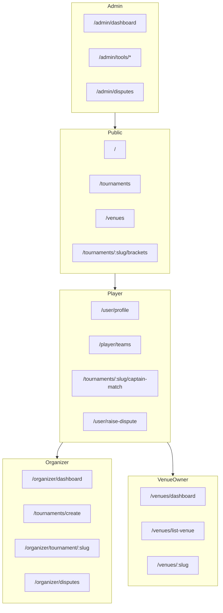

# Esportra Staging Testing Guide

> **Version 1.0** — For Discord beta testers  
> **Environment:** Staging only — not production

Use this guide before every rollout. Report issues in the Discord **Testing** category using the templates at the end of this document.

**How to use this in Discord**

1. Pin this document (or a link to it) in the Testing category.
2. Copy report templates from [Section 16](#16-copy-paste-report-templates) into a Discord code block (triple backticks) for easy reading.
3. Attach screenshots directly to your message — do not paste sensitive tokens or passwords.

---

## Table of Contents

1. [What You Are Testing](#1-what-you-are-testing)
2. [Before You Start](#2-before-you-start)
3. [Testing Rules](#3-testing-rules)
4. [Platform Overview](#4-platform-overview)
5. [Guest / Public Testing](#5-guest--public-testing)
6. [Player Testing](#6-player-testing)
7. [Organizer Testing](#7-organizer-testing)
8. [Venue Owner Testing](#8-venue-owner-testing)
9. [Admin Testing](#9-admin-testing)
10. [Staff Testing](#10-staff-testing)
11. [Partner Portal Testing](#11-partner-portal-testing)
12. [Cross-Platform UX Checks](#12-cross-platform-ux-checks)
13. [30-Minute Smoke Test Path](#13-30-minute-smoke-test-path)
14. [How to Report Issues on Discord](#14-how-to-report-issues-on-discord)
15. [Severity Levels](#15-severity-levels)
16. [Copy-Paste Report Templates](#16-copy-paste-report-templates)
17. [In-App Disputes vs Discord Reports](#17-in-app-disputes-vs-discord-reports)
18. [Out of Scope](#18-out-of-scope)

---

## 1. What You Are Testing

**Esportra** is an esports tournament management and venue booking platform. Staging is a pre-release copy of the site where we validate features, UX, permissions, and stability before production rollout.

Your job is to:

- Use the platform like a real user (player, organizer, venue owner, or admin)
- Break things on purpose — wrong inputs, edge cases, fast clicking, mobile layouts
- Report issues with enough detail that we can reproduce them without asking follow-up questions

**Staging URLs**

| Service | URL |
|---------|-----|
| Frontend (main app) | `https://frontend-staging.esportra.com` |
| API (backend) | `https://api-staging.esportra.com` |
| Discord (bug reports) | `https://discord.gg/ZMBvC5vjRF` |

---

## 2. Before You Start

### Accounts and roles

Most flows need a signed-in account. The platform has these roles:

| Role | What they can do |
|------|------------------|
| **Guest** | Browse public pages only |
| **Player** (`casual` in the system) | Register for tournaments, manage teams, file disputes |
| **Organizer** | Create and run tournaments, manage brackets, resolve organizer disputes |
| **Venue Owner** | List venues, manage bookings, submit venues for review |
| **Admin** | Platform management (permission-gated sub-roles) |
| **Staff** | Tournament/org staff with limited permissions (invited by organizer) |

**If you only have a Player account:** you can still test most player and public flows. Ask in Discord if you need Organizer, Venue Owner, or Admin test accounts.

### Setup checklist

- [ ] Use **Chrome** or **Firefox** on desktop; also test at least one flow on **mobile** (phone browser)
- [ ] Confirm the site loads — if you see **"Game catalog unavailable"** full-screen, stop and report immediately (platform is blocked)
- [ ] Complete **email verification** if prompted (banner at top)
- [ ] Complete **profile setup** if prompted (country, username, etc.)
- [ ] Note your **username/email** for reports — never share passwords
- [ ] Enable screenshots or screen recording before testing complex flows
- [ ] Dismiss or read the **beta welcome modal** on first visit — it links to Discord for feedback

### Role switching (if you have multiple roles)

Some accounts can switch between Player, Organizer, and Venue Owner via the **Role Switcher** in the user menu. Test each role separately — permissions and navigation change per role.

---

## 3. Testing Rules

### Do

- Test on staging only
- One issue per Discord post (or one thread per issue)
- Include URL, role, steps, expected vs actual, and screenshots
- Search the channel first — add to an existing thread if the bug is already reported
- Retest after a fix is deployed and post a **Retest** confirmation (template below)
- Test both **happy path** (everything works) and **sad path** (errors, validation, permission denied)

### Do not

- Share passwords, tokens, or admin PINs in Discord
- Test on production (`esportra.com` production URLs)
- Delete other testers' data, tournaments, or venues without coordination
- File duplicate reports for the same bug
- Use in-app **Disputes** for platform bugs — use Discord for bugs; use Disputes for tournament/support issues (see [Section 17](#17-in-app-disputes-vs-discord-reports))
- Test internal debug routes (`/debug/riot`, `/debug/igdb`) unless explicitly asked

### What counts as a bug

- Blank or stuck loading screen (no skeleton/spinner for 5+ seconds)
- Silent failure (action does nothing, no error message)
- Wrong data shown after refresh
- Permission leak (player sees admin controls, organizer sees another org's data)
- Broken navigation (back button, deep links, 404 on valid URLs)
- Form accepts invalid data or rejects valid data
- Mobile layout broken (horizontal scroll, unreadable text, tiny buttons)
- Real-time features not updating (bracket, veto, notifications) without refresh

---

## 4. Platform Overview



**Main feature areas**

| Area | Key routes | Primary role |
|------|------------|--------------|
| Auth | `/auth/signin`, `/auth/signup` | All |
| Tournaments | `/tournaments`, `/tournaments/:slug` | Guest, Player, Organizer |
| Brackets & matches | `/tournaments/:slug/brackets`, captain match room | Player, Organizer |
| Battle Royale | `/tournaments/:slug/br-game-room` | Player, Organizer |
| Map veto | `/map-veto/:token`, captain match room | Player |
| Teams | `/player/teams` | Player |
| Venues | `/venues`, `/venues/:slug` | Guest, Venue Owner |
| Organizer ops | `/organizer/*` | Organizer, Staff |
| Admin panel | `/admin/*` | Admin |
| Account | `/account/settings`, `/notifications` | All signed-in |
| Support | `/user/raise-dispute`, `/user/my-disputes` | Player |

---

## 5. Guest / Public Testing

No login required. Verify pages load, links work, and protected actions redirect to sign-in.

### Landing and navigation

| # | Test | Route | Pass criteria |
|---|------|-------|---------------|
| 1 | Home page loads | `/` | Hero, games section, venue showcase, footer links work |
| 2 | Navbar links | All main nav | Tournaments, Venues, About, Sign In work |
| 3 | Footer links | Footer | Privacy, Terms, Discord, social links open correctly |
| 4 | 404 page | Invalid URL | Friendly "not found" page with way back home |

### Tournaments (browse only)

| # | Test | Route | Pass criteria |
|---|------|-------|---------------|
| 5 | Tournament list | `/tournaments` | Cards load; tabs: Upcoming, Live, Completed, Cancelled |
| 6 | Filters | `/tournaments` | Game, format, region filters change results |
| 7 | Tournament detail | `/tournaments/:slug` | Info, schedule, teams, bracket link visible |
| 8 | Public bracket | `/tournaments/:slug/brackets` | Bracket renders; no auth required |
| 9 | Fullscreen bracket | `/tournaments/:slug/brackets/fullscreen` | Fullscreen view; navbar hidden |
| 10 | Org profile | `/org/:slug` | Public organizer page loads |

### Venues (browse only)

| # | Test | Route | Pass criteria |
|---|------|-------|---------------|
| 11 | Venue search | `/venues` or `/venues/search` | Search and filters work |
| 12 | Featured venues | `/venues/featured` | Featured list loads |
| 13 | Venue detail | `/venues/:slug` | Photos, amenities, map, pricing, seat grid (if live) |
| 14 | Book Now (guest) | Venue detail | Redirects to sign-in or shows auth gate |

### Profiles and static pages

| # | Test | Route | Pass criteria |
|---|------|-------|---------------|
| 15 | Public player profile | `/player/:username` | Public tabs only; no private data |
| 16 | Leaderboards | `/leaderboards` | Rankings load |
| 17 | Partners | `/partners`, `/be-a-partner` | Content and CTAs work |
| 18 | Help & legal | `/help`, `/privacy`, `/terms`, `/refund-policy`, `/about/faq` | Content renders |
| 19 | Organizer guide | `/guides/organizer` | Public organizer documentation loads |
| 20 | Tournament history | `/tournament-history` | Public tournament archive loads |

### Auth entry (do not complete unless testing auth)

| # | Test | Route | Pass criteria |
|---|------|-------|---------------|
| 21 | Sign in page | `/auth/signin` | Email/password form; Google and Discord OAuth visible |
| 22 | Sign up page | `/auth/signup` | Registration form loads |
| 23 | Forgot password | `/auth/forgot-password` | Form submits without error |

### Guest access control

- [ ] `/organizer/dashboard` → redirect or unauthorized
- [ ] `/admin/dashboard` → redirect or unauthorized
- [ ] `/tournaments/create` → redirect or unauthorized
- [ ] `/venues/list-venue` → redirect or unauthorized
- [ ] `/tournaments/:slug/captain-match` → redirect to sign-in

---

## 6. Player Testing

Sign in as a **Player** account. Complete profile if prompted.

### Authentication and account

| # | Test | Route | Pass criteria |
|---|------|-------|---------------|
| 1 | Email sign up | `/auth/signup` | Account created; verification email sent |
| 2 | Email sign in | `/auth/signin` | Lands on profile or return URL |
| 3 | OAuth (if enabled) | Sign in page | Google / Discord login completes |
| 4 | Email verification | Banner + `/auth/verify-email` | Banner clears after verify |
| 5 | Forgot / reset password | `/auth/forgot-password`, `/auth/reset-password` | Reset flow works |
| 6 | Account settings | `/account/settings` | Profile, security, connected accounts, notifications |
| 7 | Link Steam / Riot | Account settings | OAuth callback completes; account shows linked |
| 8 | Suspended account | `/suspended` | Suspended users see suspension page, not main app |

### Profile and teams

| # | Test | Route | Pass criteria |
|---|------|-------|---------------|
| 9 | Player profile | `/user/profile` or `/player/profile` | Tabs: profile, tournaments, teams, bookings, achievements |
| 10 | Edit profile | Profile dialog | Avatar, bio, country save and persist after refresh |
| 11 | Match history | `/player/history` | Past tournaments listed |
| 12 | Create team | `/player/teams` | Team created with name |
| 13 | Invite member | Teams page | Invite sent; invitee can accept |
| 14 | Leave team | Teams page | Confirmation dialog; user removed from roster |

### Tournament registration and play

| # | Test | Route | Pass criteria |
|---|------|-------|---------------|
| 15 | Browse and open tournament | `/tournaments/:slug` | Detail page loads |
| 16 | Register (team) | Tournament detail | Registration succeeds; appears in My Tournaments |
| 17 | Register (solo) | Solo tournament | Solo registration works if format allows |
| 18 | Unregister | Tournament detail | Confirmation; removed from participants |
| 19 | Invite code | `/invitations/redeem?code=...` | Code redeems when valid |
| 20 | Check-in | Tournament detail | Check-in button works in window; disabled outside window |
| 21 | View bracket | `/tournaments/:slug/brackets` | User's matches identifiable |
| 22 | Captain match room | `/tournaments/:slug/captain-match/:matchId` | Match check-in, scheduling, chat load |
| 23 | Map veto | Captain match or `/map-veto/:token` | Turn indicator, pick/ban updates in real time |
| 24 | Score reporting | Captain match room | Score submit works; opponent sees update |
| 25 | BR game room | `/tournaments/:slug/br-game-room` | Lobby codes, group info, leaderboard |
| 26 | Time proposals | Captain match room | Propose/accept/decline times |

### Notifications and verification

| # | Test | Route | Pass criteria |
|---|------|-------|---------------|
| 27 | Notifications list | `/notifications` | Notifications load; click navigates to target |
| 28 | Notification badge | Navbar | Unread count updates |
| 29 | Request organizer verification | `/verification` | Request submits; status visible |
| 30 | Staff invites | `/user/staff-invites` | Accept/decline org staff invite |

### Venue bookings (player)

| # | Test | Route | Pass criteria |
|---|------|-------|---------------|
| 31 | Book venue | `/venues/:slug` → Book flow | Booking dialog; availability check |
| 32 | My bookings | Profile → Bookings tab | Upcoming/past bookings listed |

### Player disputes (in-app support)

| # | Test | Route | Pass criteria |
|---|------|-------|---------------|
| 33 | Raise tournament dispute | `/user/raise-dispute` | Form submits; reference number shown |
| 34 | Raise general support | `/user/raise-dispute` | General support type routes to admin |
| 35 | Upload evidence | Raise dispute | File upload succeeds |
| 36 | Track disputes | `/user/my-disputes` | Status updates: open, in_review, resolved, rejected |

---

## 7. Organizer Testing

Sign in as **Organizer** (or switch role). Complete organization setup if required.

### Organization setup

| # | Test | Route | Pass criteria |
|---|------|-------|---------------|
| 1 | Setup wizard | `/organizer/setup-organization` | Org created; public profile at `/org/:slug` |
| 2 | Organizer dashboard | `/organizer/dashboard` | Tabs: Tournaments, Participants, Schedule, Analytics, History, Organization, Staff |
| 3 | Organization settings | Dashboard → Organization | Banner, bio, social links save |

### Tournament creation

| # | Test | Route | Pass criteria |
|---|------|-------|---------------|
| 4 | Create tournament | `/tournaments/create` | Wizard steps: basic info, format/rules, registration, review |
| 5 | Game selection | Wizard step 1 | Games load from catalog; invalid combos rejected |
| 6 | Format & rules | Wizard step 2 | Bracket type, team size, check-in, map pool |
| 7 | Registration settings | Wizard step 3 | Entry limits, invite codes, visibility |
| 8 | Review & publish | Wizard final step | Tournament created; appears in manage list |
| 9 | Edit tournament | `/organizer/tournament/:slug/edit` | Changes persist after save |

### Tournament management

| # | Test | Route | Pass criteria |
|---|------|-------|---------------|
| 10 | Manage list | `/organizer/tournaments` | All org tournaments listed with status |
| 11 | Tournament manage page | `/organizer/tournament/:slug` | Tabs load: overview, participants, stages, schedule, disputes, staff, settings |
| 12 | Participants | Manage → Participants | Approve/remove teams; ban/unban |
| 13 | Stages & brackets | Manage → Stages | Generate bracket; matches created |
| 14 | Bracket management | `/organizer/tournament/:slug/manage-bracket/:stageId` | Edit matches, enter results |
| 15 | Public bracket view | `/organizer/tournament/:slug/brackets` | Matches reflect admin changes |
| 16 | BR stages (if BR game) | Manage → Games tab | Round management, map assignment, results |
| 17 | Announcements | Manage page | Announcement sends; players receive notification |
| 18 | Staff assignment | Manage → Staff | Invite staff; assign permissions |
| 19 | Mock mode (if available) | Manage page | Test flow without affecting live data |

### Organizer disputes

| # | Test | Route | Pass criteria |
|---|------|-------|---------------|
| 20 | Dispute inbox | `/organizer/disputes` | Organizer-routed disputes appear |
| 21 | Resolve dispute | Organizer disputes | Resolve with notes; player sees update |
| 22 | Reject dispute | Organizer disputes | Reject with reason; status updates |

**Dispute reasons routed to organizer:** match result, scheduling, technical issue, rule violation, roster violation, ban appeal.

---

## 8. Venue Owner Testing

Sign in as **Venue Owner** (requires verification approval on staging).

### Venue dashboard

| # | Test | Route | Pass criteria |
|---|------|-------|---------------|
| 1 | Dashboard | `/venues/dashboard` or `/venue-owner/dashboard` | Venue list, stats, status badges |
| 2 | List new venue | `/venues/list-venue` | Multi-step wizard completes |
| 3 | Edit venue | `/venues/edit/:id` | Details, images, pricing, amenities save |
| 4 | Submit for review | Dashboard | Status changes draft → pending_review |
| 5 | Analytics | Dashboard → Analytics | Views, impressions, contact clicks |

### Public venue visibility

| # | Test | Route | Pass criteria |
|---|------|-------|---------------|
| 6 | Published venue | `/venues/:slug` | Public page shows approved venue |
| 7 | Draft venue | `/venues/:slug` | Not publicly visible or shows appropriate state |
| 8 | Live seat grid | Venue detail | Free/occupied/reserved seats display (if enabled) |
| 9 | Booking flow | Venue detail | Availability check; booking confirmation |

### Venue lifecycle statuses to verify

- `draft` — only owner sees it
- `pending_review` — submitted, awaiting admin
- `published` — live on `/venues`
- `rejected` — owner notified; can edit and resubmit
- `suspended` / `archived` — hidden or restricted appropriately

### Desktop pairing (venue owners)

| # | Test | Route | Pass criteria |
|---|------|-------|---------------|
| 10 | Desktop pairing | `/account/settings` | Hub pairing section visible for venue owners |

> **Note:** Full station lock/unlock is tested via the Esportra Desktop Suite, not the web app. Report desktop issues separately if you have access.

---

## 9. Admin Testing

**Admin accounts only.** Sub-roles have different permissions — verify menu items hide when you lack access.

### Dashboard and operations

| # | Test | Route | Pass criteria |
|---|------|-------|---------------|
| 1 | Admin dashboard | `/admin/dashboard` | Stats, alerts, recent activity load |
| 2 | User management | `/admin/tools/user-management` | Search, view, suspend/unsuspend users |
| 3 | Tournament management | `/admin/tools/tournament-management` | List, feature, approve tournaments |
| 4 | Team management | `/admin/tools/team-management` | Team search and management |
| 5 | Venue management | `/admin/tools/venue-management` | Approve/reject/suspend venues |
| 6 | Verification queue | `/admin/tools/verification-system` | Organizer/venue verification requests |
| 7 | Dispute center | `/admin/disputes` | Admin-routed disputes; resolve/reject |
| 8 | Audit logs | `/admin/tools/audit-logs` | Admin actions logged with detail panel |
| 9 | Analytics | `/admin/tools/analytics` | Platform metrics load |
| 10 | Alerts | `/admin/tools/alerts` | Acknowledge alerts |

### Growth and content

| # | Test | Route | Pass criteria |
|---|------|-------|---------------|
| 11 | Sponsor management | `/admin/tools/sponsor-management` | Partner/sponsor linking |
| 12 | Game catalog | `/admin/tools/game-catalog` | Games, modes, structures editable |
| 13 | License management | `/admin/tools/license-management` | Organizer licenses |
| 14 | Content moderation | `/admin/tools/moderation` | Moderation queue |

### Control plane (super admin / ops)

| # | Test | Route | Pass criteria |
|---|------|-------|---------------|
| 15 | Role builder | `/admin/tools/role-builder` | Roles and permissions |
| 16 | Admin management | `/admin/tools/admin-management` | Admin user assignment |
| 17 | Kill switches | `/admin/tools/kill-switches` | Feature toggles |
| 18 | Session management | `/admin/tools/sessions` | Active sessions |
| 19 | IP allowlist | `/admin/tools/ip-allowlist` | IP rules |
| 20 | System settings | `/admin/tools/system-settings` | Config saves |

### Permission testing

- [ ] Direct URL to tool without permission → `/unauthorized` or redirect
- [ ] Menu hides tools you cannot access
- [ ] Player account cannot access any `/admin/*` route

**Admin sub-roles:** `super_admin`, `ops_admin`, `moderator`, `finance_admin`, `support_admin` — test with the account matching the role you were given.

---

## 10. Staff Testing

Staff are invited by organizers — not a global platform role.

| # | Test | Route | Pass criteria |
|---|------|-------|---------------|
| 1 | Receive staff invite | `/user/staff-invites` | Invite appears; accept works |
| 2 | Staff dashboard | `/staff/dashboard` | Assigned orgs and tournaments listed |
| 3 | Tournament access | `/organizer/tournament/:slug` | Only permitted tabs visible |
| 4 | Score update permission | Manage tournament | Can update scores if `scores:update` granted |
| 5 | Bracket edit permission | Manage bracket | Can edit if `bracket:edit` granted |
| 6 | No access without invite | `/organizer/tournament/:slug` | Unauthorized without assignment |

---

## 11. Partner Portal Testing

The **Partner Portal** is a separate app for sponsors/partners (not the main staging frontend). Ask in the Testing channel for the current **staging partner portal URL** — it may differ from production (`partner.esportra.com`).

| # | Test | Route | Pass criteria |
|---|------|-------|---------------|
| 1 | Login | `/login` | Partner auth works |
| 2 | Set password | `/set-password` | New partner password flow |
| 3 | Onboarding | `/onboarding` | Wizard completes for new partners |
| 4 | Dashboard | `/dashboard` | Profile, stats, tier display |
| 5 | Analytics | `/analytics` | Impression/click metrics |
| 6 | Assets | `/assets` | Asset management |
| 7 | Account | `/account` | Account settings |

Public marketing pages on main app: `/partners`, `/be-a-partner`.

---

## 12. Cross-Platform UX Checks

Apply these checks on **every major flow** you test.

### Loading and feedback

- [ ] Initial page load shows skeleton or spinner (not blank screen)
- [ ] Button click shows loading state within 100ms
- [ ] Background refresh keeps stale data visible with subtle indicator
- [ ] No loading state longer than 3 seconds without extra message

### Error and empty states

- [ ] Network error shows banner or message with retry option
- [ ] Empty lists show designed empty state with CTA (not blank)
- [ ] Form validation shows inline errors below fields
- [ ] 403/404 pages are friendly with navigation options

### Navigation and access

- [ ] Browser back button works correctly
- [ ] Deep links load the correct page (paste URL in new tab)
- [ ] Auth-gated pages redirect to sign-in with return URL
- [ ] Role-gated pages block unauthorized users with clear message

### Mobile (test at least 3 flows)

- [ ] Layout usable at 375px width (iPhone SE)
- [ ] Touch targets at least 44px
- [ ] No horizontal scroll (except bracket views)
- [ ] Modals become full-screen sheets on mobile
- [ ] Bottom nav works on mobile layout

### Real-time features

- [ ] Bracket updates after match result (without manual refresh, or with clear refresh prompt)
- [ ] Map veto shows opponent actions in real time
- [ ] Notifications appear for match ready, check-in, dispute updates
- [ ] Stale data conflict shows "already updated" message

### Accessibility basics

- [ ] Tab key reaches all interactive elements
- [ ] Focus visible on buttons and links
- [ ] Status not conveyed by color alone (icons or text labels)
- [ ] Reduced motion: animations respect system preference

---

## 13. 30-Minute Smoke Test Path

Use this when you have limited time. Report anything broken along the way.

| Step | Time | Action | Role |
|------|------|--------|------|
| 1 | 5 min | Browse home, tournaments, one bracket, one venue | Guest |
| 2 | 5 min | Sign in → profile → notifications | Player |
| 3 | 5 min | Register for a tournament → view bracket | Player |
| 4 | 5 min | Captain match room OR BR game room (if match available) | Player |
| 5 | 5 min | Create tournament → add participant → generate bracket | Organizer |
| 6 | 3 min | Raise a test dispute → check My Disputes | Player |
| 7 | 2 min | Post any issues to Discord using template below | All |

**Extended smoke (add 15 min):** venue browse + booking, organizer dispute resolve, admin verification queue check.

---

## 14. How to Report Issues on Discord

Post in the **Testing** category. One issue per post (use threads for follow-ups).

### Required fields

Every bug report must include:

| Field | Example |
|-------|---------|
| **Title** | `[STAGING] Tournament registration fails on mobile` |
| **Severity** | Critical / High / Medium / Low (see [Section 15](#15-severity-levels)) |
| **Role** | Player / Organizer / Venue Owner / Admin / Guest |
| **URL** | Full path: `https://frontend-staging.esportra.com/tournaments/summer-cup` |
| **Account** | `@username` or `tester@email.com` — no passwords |
| **Steps** | Numbered 1, 2, 3... to reproduce |
| **Expected** | What should happen |
| **Actual** | What happened instead |
| **Screenshot/video** | Attach both if possible |
| **Browser/device** | `Chrome 124 / Windows 11` or `Safari / iPhone 15` |
| **Time (UTC)** | When it occurred |
| **Frequency** | Always / Sometimes / Once |

### Discord post format

Use this structure in your message:

```
**[STAGING] <short title>**
Severity: High
Role: Player
URL: https://frontend-staging.esportra.com/...
Account: @yourusername

**Steps to reproduce**
1. Sign in as player
2. Go to /tournaments/summer-cup
3. Click Register
4. Select team "Test Squad"
5. Click Confirm

**Expected**
Registration succeeds; toast "Registered"; team appears in participants

**Actual**
Button spins forever; no error message; refresh shows not registered

**Environment**
Chrome 124 / Windows 11 · 1920×1080
Time: 2026-06-10 14:30 UTC
Frequency: Always

**Attachments**
[Screenshot or video]
```

### Thread etiquette

- **Duplicate?** Search first. Reply in existing thread with "+1" and your environment details
- **More info needed?** Reply in thread; do not create a new post
- **Fixed?** Post a **Retest** confirmation (template in [Section 16](#16-copy-paste-report-templates))
- **Still broken after fix?** Reply in original thread with new screenshots and deployment date if known

---

## 15. Severity Levels

| Level | Definition | Examples | Response expectation |
|-------|------------|----------|-------------------|
| **Critical** | Site unusable or data loss/security issue | Cannot sign in; catalog down; wrong user sees admin panel; data deleted unexpectedly | Fix before rollout |
| **High** | Core flow broken for many users | Cannot register for tournament; bracket does not generate; payment/booking fails | Fix before rollout |
| **Medium** | Feature broken but workaround exists | Filter does not work; notification delay; mobile layout issue on one page | Fix soon; may ship with known issue |
| **Low** | Cosmetic, typo, minor UX | Wrong label; spacing; non-blocking toast text | Backlog |

When in doubt, mark **High** and let the team downgrade.

---

## 16. Copy-Paste Report Templates

### Bug report (full)

```
**[STAGING] <title>**
Severity: 
Role: 
URL: 
Account: 

**Steps to reproduce**
1. 
2. 
3. 

**Expected**

**Actual**

**Environment**
Browser/device: 
Screen size: 
Time (UTC): 
Frequency: Always / Sometimes / Once

**Attachments**
```

### UX / design feedback

```
**[STAGING][UX] <title>**
Role: 
URL: 
Page/section: 

**What feels wrong**

**What would be better**

**Screenshot/mockup**
```

### Content / typo

```
**[STAGING][CONTENT] <title>**
URL: 
Location on page: 

**Current text**

**Suggested text**
```

### Access / permission issue

```
**[STAGING][ACCESS] <title>**
Severity: High
Role tested: 
URL: 
Account: 

**What I tried to do**

**What happened** (blocked / saw wrong data / unauthorized)

**What I expected** (access granted / data hidden)
```

### Retest confirmation (after fix)

```
**[STAGING][RETEST] <original issue title>**
Original thread: <link or message ID>
Status: FIXED / STILL BROKEN / PARTIALLY FIXED

**Retested on**
Date (UTC): 
Environment: 

**Notes**
```

---

## 17. In-App Disputes vs Discord Reports

Use the right channel for the right problem.

| Problem type | Where to report | Route |
|--------------|-----------------|-------|
| **Platform bug** (site broken) | Discord Testing channel | — |
| **UX feedback** | Discord Testing channel | — |
| **Tournament dispute** (match, rules, scheduling) | In-app dispute | `/user/raise-dispute` |
| **General platform support** | In-app dispute (General Support) | `/user/raise-dispute` |
| **Track dispute status** | In-app | `/user/my-disputes` |

### Tournament dispute routing

| Reason | Resolved by |
|--------|-------------|
| Match result discrepancy | Organizer |
| Scheduling / no-show | Organizer |
| Technical issue / server problems | Organizer |
| Tournament rule violation | Organizer |
| Roster violation | Organizer |
| Ban appeal | Organizer |
| Cheating / hacking | Admin |
| Unsportsmanlike conduct | Admin |
| Other | Admin |
| General support (no tournament) | Admin |

---

## 18. Out of Scope

Do **not** file staging web bugs for these unless explicitly asked to test them:

| Item | Notes |
|------|-------|
| **Esportra Desktop Suite** | Station lock/unlock, overwolf app — separate repo |
| **Station Agent** | Windows tray agent — separate testing |
| **SignalR hub** (station grid) | Real-time station control via desktop, not web |
| **CS2 / Faceit match integration** | Parked — not in current scope |
| **Debug routes** | `/debug/riot`, `/debug/igdb` — internal only |
| **Production environment** | `https://esportra.com` — staging testers must not use production |

---

## Quick Reference Card

```
Staging:  https://frontend-staging.esportra.com
Discord:  https://discord.gg/ZMBvC5vjRF
Report:   One issue per post · URL · Role · Steps · Expected vs Actual · Screenshot
Severity: Critical > High > Medium > Low
Bugs:     Discord
Disputes: /user/raise-dispute (in-app)
```

---

*Thank you for helping ship a stable Esportra. Good reports save hours of debugging.*
